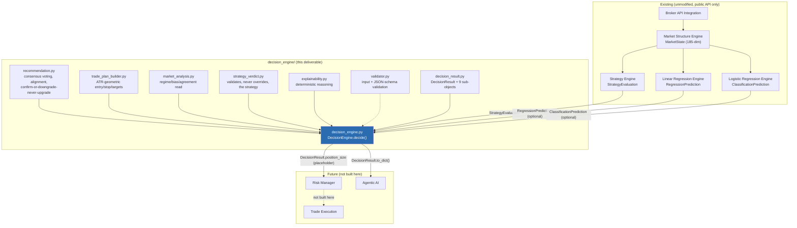
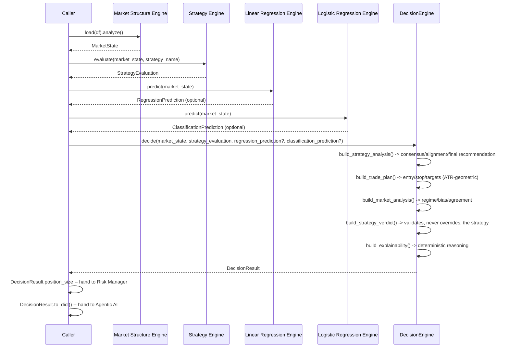

# Decision Engine Report

A production-grade Decision Engine that combines the Strategy Engine, the
Linear Regression Engine, and the Logistic Regression Engine into one
unified, explainable `DecisionResult` -- the single source of truth for
the Forex Dynamics platform. It does not execute trades, does not
calculate risk or position size, and does not compute an indicator, read a
candle, or perform market structure analysis itself. Its `position_size`
field is a stable placeholder for the existing Risk Manager.

**Test suite: 794 tests passing, 1 skipped** across all eight packages
(`market_structure`, `ml_pipeline`, `training`, `strategy`,
`linear_regression`, `logistic_regression`, `model_monitor`,
`decision_engine`), **120 of them new for this deliverable**, 0 failing.
Verified end-to-end against real OANDA EUR/USD M5 data via
`examples/decision_engine_example.py`: evaluated a real
`trend_following` strategy, trained a real Linear Regression model and a
real Logistic Regression model, and combined all three into one
schema-valid `DecisionResult` with a coherent, deterministic explanation.

## Starting State

This task was framed as "enhance the existing `DecisionResult`" with
strict backward-compatibility requirements. **No Decision Engine, Risk
Manager, or Agentic AI exists anywhere in this repository** -- confirmed
by an exhaustive search before starting. Rather than fabricate a fictional
prior version to "extend," this deliverable builds the complete target
schema the spec describes as one coherent whole. The backward-
compatibility requirement is honored in spirit and will bind going
forward: every field below is additive, `DecisionResult.recommendation`
alone is sufficient for a minimal consumer, and future changes to this
engine must only add fields, never rename or remove one.

## Architecture



## Class Diagram

```mermaid
classDiagram
    class DecisionEngine {
        +config: DecisionEngineConfig
        +decide(market_state, strategy_evaluation, regression_prediction?, classification_prediction?) DecisionResult
    }

    class DecisionResult {
        +recommendation: str  "BUY|SELL|WAIT|NO_TRADE"
        +strategy: StrategyAnalysis
        +linear_regression: LinearRegressionAnalysis
        +logistic_regression: LogisticRegressionAnalysis
        +trade_plan: TradePlan
        +position_size: PositionSizePlaceholder
        +market_analysis: MarketAnalysis
        +strategy_verdict: StrategyVerdict
        +reasoning: Explainability
        +metadata: DecisionMetadata
        +to_dict() dict
    }
    DecisionEngine --> DecisionResult

    class StrategyAnalysis {
        +strategy_recommendation, market_bias
        +strategy_compliance, strategy_confidence, strategy_validation_score
        +forecast_alignment, probability_alignment, consensus_score
        +decision_confidence, opportunity_score, trade_quality_score
    }
    class LinearRegressionAnalysis {
        +available: bool
        +expected_close/high/low/return/pip_movement/volatility/MFE/MAE
        +prediction_confidence, prediction_interval
    }
    class LogisticRegressionAnalysis {
        +available: bool
        +predicted_class, buy/sell/no_trade_probability
        +classification_confidence, probability_margin, entropy
    }
    class TradePlan {
        +direction: BUY|SELL|NONE
        +entry_price, stop_loss, take_profit_1/2/3
        +risk_reward_ratio, expected_holding_time
        +expected_pip_gain, expected_maximum_drawdown
        +target_feasibility, trade_quality_score
    }
    class PositionSizePlaceholder {
        +calculated_by: "RiskManager"
        +status: "Pending"
    }
    class MarketAnalysis {
        +market_bias, agreement_level, forecast_quality
        +prediction_stability, market_regime, current_trend
    }
    class StrategyVerdict {
        +overall_strategy_quality
        +historical_success_probability: float|None
        +live_market_alignment, model_alignment
        +validation_status, recommended_action
    }
    class Explainability {
        +supporting_factors, opposing_factors, summary
        +why_buy, why_sell, why_wait
        +strategy_compliance_explanation, forecast_explanation, probability_explanation
    }
    class DecisionMetadata {
        +currency_pair, timeframe, timestamp
        +strategy/feature/market_structure/linear_regression/logistic_regression/decision_engine_version
    }

    DecisionResult --> StrategyAnalysis
    DecisionResult --> LinearRegressionAnalysis
    DecisionResult --> LogisticRegressionAnalysis
    DecisionResult --> TradePlan
    DecisionResult --> PositionSizePlaceholder
    DecisionResult --> MarketAnalysis
    DecisionResult --> StrategyVerdict
    DecisionResult --> Explainability
    DecisionResult --> DecisionMetadata
```



## Response Schema

Every section is required and always present -- `linear_regression`/
`logistic_regression` degrade to an all-`None` `available: false` shape
when that engine's prediction wasn't supplied to `decide()`, rather than
being omitted (so a consumer can always safely read
`result["linear_regression"]["available"]` without a `KeyError`).

| Top-level key | Type | Always present? |
|---|---|---|
| `recommendation` | `str` (`BUY`/`SELL`/`WAIT`/`NO_TRADE`) | Yes |
| `strategy` | object (STRATEGY ANALYSIS) | Yes |
| `linear_regression` | object, `available: false` if not supplied | Yes |
| `logistic_regression` | object, `available: false` if not supplied | Yes |
| `trade_plan` | object, `direction: "NONE"` if no active trade | Yes |
| `position_size` | `{"calculated_by": "RiskManager", "status": "Pending"}` | Yes, always identical |
| `market_analysis` | object | Yes |
| `strategy_verdict` | object | Yes |
| `reasoning` | object | Yes |
| `metadata` | object | Yes |

`decision_engine.validator.validate_decision_result_dict()` enforces this
shape structurally (every required key in every section) and is exercised
against both a fully-populated decision (all 3 engines) and a
strategy-only decision in `tests/test_de_decision_engine.py`.

## Combination Logic (STRATEGY ANALYSIS)

`recommendation.py` implements deterministic, confidence-weighted vote
combination -- **not a new predictive model**:

1. Each available source casts a direction vote (`-1`/`0`/`+1`) weighted by
   its own confidence: strategy (from `market_bias`), regression (sign of
   `expected_return`/`expected_pip_move`), classification (`predicted_class`).
2. **`consensus_score`** = `abs()` of the weighted average across every
   *available* source (including the strategy's own vote).
3. **`forecast_alignment`**/**`probability_alignment`** = 100 (agree), 0
   (oppose), or 50 (one side neutral) between the strategy's direction and
   each model's direction independently.
4. **The final `recommendation`** can only **confirm** or **downgrade**
   the Strategy Engine's own call -- never upgrade it:
   - `strategy_recommendation == "NO_TRADE"` -> always `"NO_TRADE"`.
   - `strategy_recommendation == "WAIT"` -> always `"WAIT"` (models can
     never promote a WAIT into a trade the strategy itself didn't clear).
   - `strategy_recommendation in ("BUY", "SELL")` -> confirmed unless the
     **regression+classification-only** net vote opposes it by at least
     `config.downgrade_opposition_threshold` (default 0.5), in which case
     it downgrades to `"WAIT"`.

   `test_de_recommendation.py::test_wait_never_upgraded_even_with_strong_model_agreement`
   and `test_de_decision_engine.py::test_never_upgrades_wait_to_a_trade`
   pin this down directly, including via the parametrized sweep over every
   `model_net` value in `[-1, 1]`.
5. **`decision_confidence`**/**`opportunity_score`**/**`strategy_validation_score`**
   are renormalized blends (config-weighted) of the compliance/confidence/
   overall-score/consensus/forecast-strength inputs actually available.

## Trade Plan

`trade_plan_builder.py` places all five price levels geometrically from
two already-computed values -- `market_state.price_action.current_close`
and `market_state.indicators["atr"]` -- never a fresh indicator
calculation, and never a position-size/account-risk calculation:

```
entry_price   = current close
stop_loss     = entry -/+ (ATR * stop_atr_multiple)          # default 1.5x ATR
take_profit_1 = entry +/- (stop_distance * 1.0)               # 1R
take_profit_2 = entry +/- (stop_distance * 2.0)               # 2R -- risk_reward_ratio
take_profit_3 = entry +/- (stop_distance * 3.0)               # 3R
```

`expected_pip_gain` prefers the Linear Regression model's own
`expected_pip_move` when its sign agrees with the trade direction (a more
informative headline number than the fixed geometric TP2 distance);
`expected_maximum_drawdown` prefers `expected_MAE` when available, else
the planned stop distance in pips. `target_feasibility` compares the
planned TP2 distance against the model's `expected_MFE` when available,
else falls back to cross-engine `consensus_score` as the best available
proxy. If the ATR isn't yet valid (`indicator_validity["atr"] < 1.0`,
warm-up) or the final recommendation is WAIT/NO_TRADE, price levels stay
`None` rather than fabricating a plan from an unreliable or nonexistent
signal -- confirmed by `test_de_trade_plan_builder.py::test_invalid_atr_yields_entry_only_no_stop_or_targets`.

## Strategy Verdict

**Never overrides the user's strategy** -- `strategy_verdict.py` only
*validates* it against the live market (`strategy_compliance` +
`market_quality_score` -> `live_market_alignment`) and against the two ML
engines (`forecast_alignment` + `probability_alignment` -> `model_alignment`).
`validation_status` buckets into `Validated` / `Conflicting` /
`Not Validated` / `Partially Validated`, and `recommended_action` is
advice about the **strategy's own fitness** ("review rule weights",
"continue as configured"), never a BUY/SELL/WAIT trade instruction --
that distinction is enforced by construction: `recommended_action` is
looked up from a fixed table keyed only by `validation_status`, with no
path back to the trade recommendation.

`historical_success_probability` is honestly `None` unless the caller
explicitly passes `historical_win_rate=` to `decide()` -- this platform
does not yet maintain a historical trade/backtest log, and the spec's
example JSON's numeric confidence values are illustrative, not a license
to fabricate a statistic with no data behind it. Pass it explicitly once a
backtest engine or trade journal exists.

## Explainability

Every string in `reasoning` is built from already-computed values --
`test_de_explainability.py::test_deterministic_given_identical_inputs`
confirms byte-identical output for identical input, and
`test_de_decision_engine.py::test_explainability_deterministic_across_repeated_calls`
confirms it against a real end-to-end decision. `why_buy`/`why_sell`/
`why_wait` are **all three always generated** (not just the chosen
action) -- each states the concrete evidence (or its absence) for that
specific direction, so a user can see the full case, not just a
post-hoc rationalization of whatever was picked.

## JSON Examples

**Full decision (all 3 engines supplied), live OANDA EUR/USD M5** (trimmed
for readability -- see `examples/decision_engine_example.py` for the
complete, real run):

```json
{
  "recommendation": "WAIT",
  "strategy": {
    "strategy_recommendation": "WAIT", "market_bias": "BEARISH",
    "strategy_compliance": 55.53, "strategy_confidence": 75.97,
    "forecast_alignment": 0.0, "probability_alignment": 50.0,
    "consensus_score": 18.75, "decision_confidence": 61.62
  },
  "linear_regression": {
    "available": true, "expected_pip_movement": 13.68, "prediction_confidence": 42.21
  },
  "logistic_regression": {
    "available": true, "predicted_class": "NO_TRADE", "no_trade_probability": 0.815,
    "classification_confidence": 61.91
  },
  "trade_plan": { "direction": "NONE", "trade_quality_score": 29.65 },
  "position_size": { "calculated_by": "RiskManager", "status": "Pending" },
  "strategy_verdict": {
    "validation_status": "Partially Validated",
    "recommended_action": "Mixed signals across the strategy and the two model forecasts -- proceed with caution and confirm with additional analysis."
  },
  "reasoning": {
    "opposing_factors": ["Linear Regression forecast direction opposes the strategy's market bias."],
    "summary": "Final recommendation: WAIT (from strategy recommendation WAIT), consensus score 18.7/100."
  }
}
```

**Strategy-only decision** (no ML predictions supplied) -- both ML
sections degrade cleanly rather than being omitted:

```json
{
  "recommendation": "NO_TRADE",
  "linear_regression": { "available": false, "expected_close": null, "...": null },
  "logistic_regression": { "available": false, "predicted_class": null, "...": null }
}
```

## Integration Flow



## Testing

- `test_de_config_version.py` / `test_de_validator.py` -- config
  validation, JSON schema validation (every required key in every
  section, invalid `recommendation` values rejected).
- `test_de_recommendation.py` -- consensus/alignment math and the
  confirm-or-downgrade-never-upgrade rule, including a full sweep proving
  a downgrade can never flip direction (only ever lands on WAIT).
- `test_de_trade_plan_builder.py` -- BUY/SELL geometry, ATR-warm-up
  handling, RR-ratio configurability, MFE/MAE-aware feasibility/drawdown.
- `test_de_market_analysis.py` / `test_de_strategy_verdict.py` /
  `test_de_explainability.py` -- every bucket/label boundary, determinism.
- `test_de_decision_engine.py` -- full end-to-end against a **real**
  `TrendFollowingStrategy` + `RegressionEngine` + `LogisticRegressionEngine`
  (session-scoped trained-engine fixtures shared with `model_monitor`'s
  test suite): backward compatibility (a `recommendation`-only consumer),
  Risk Manager placeholder identity, Agentic AI compatibility
  (`json.dumps`/`json.loads` round-trip), metadata correctness, and the
  strategy-only degraded-shape path.

## Future Extension Points

| To add... | Do this |
|---|---|
| A real historical win-rate source | Once a backtest engine or trade journal exists, pass `historical_win_rate=` to `decide()` -- `strategy_verdict.py` already threads it through; nothing else changes. |
| A new StrategyAnalysis/MarketAnalysis factor | Add a pure component function following the existing pattern (e.g. `_agreement_level`) and fold it into the relevant `build_*()` call -- `DecisionResult`'s dataclasses are additive-only by contract. |
| A 4th analytical engine | Add its own `_<engine>_analysis()` adapter (duck-typed, mirroring `_linear_regression_analysis`/`_logistic_regression_analysis`) and an additional optional parameter to `decide()`; extend the vote/consensus math in `recommendation.py` the same way regression/classification were added. |
| Threshold-based position sizing | Not built here (explicitly out of scope) -- `DecisionResult.position_size` is a stable `{"calculated_by": "RiskManager", "status": "Pending"}` placeholder; the Risk Manager fills it in downstream without any Decision Engine change. |
| Consumption by the Agentic AI | `DecisionResult.to_dict()` is already flat, nested-but-nullable, and JSON-safe (confirmed via `json.dumps`/`json.loads` round-trip in tests) -- no further adaptation needed. |
