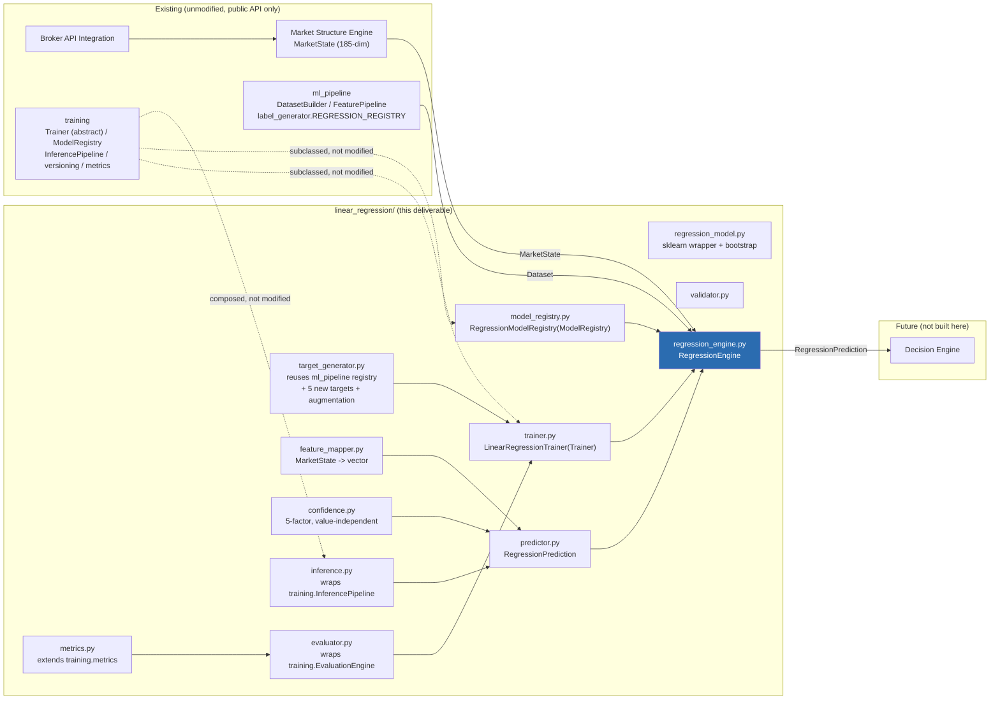
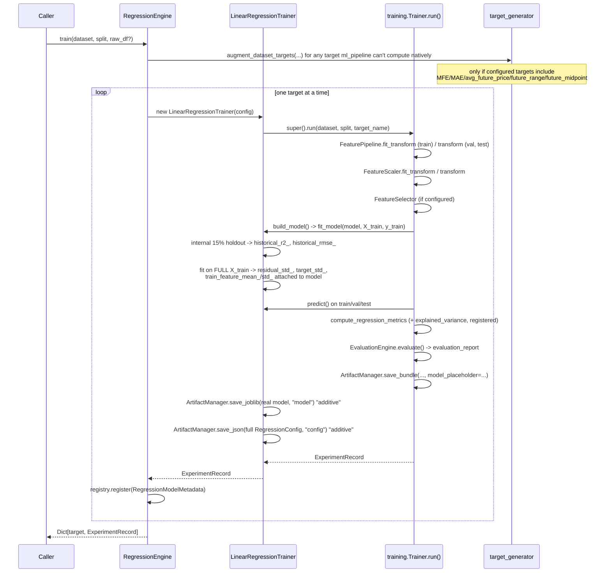
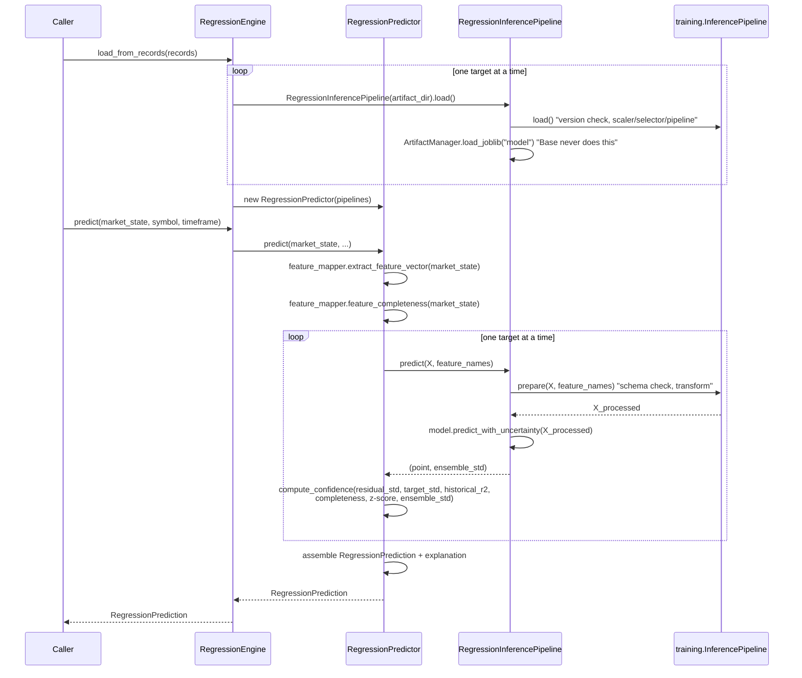

# Linear Regression Engine Report

A production-grade Linear Regression Engine that estimates future market
movement from the current `MarketState`. It does not execute trades, does
not decide BUY/SELL, and does not implement Logistic Regression, a Decision
Engine, a Risk Manager, or broker communication. Its sole output,
`RegressionPrediction`, is meant to be consumed by a future Decision Engine.

**Test suite: 377 tests passing** across all five packages (`market_structure`,
`ml_pipeline`, `training`, `strategy`, `linear_regression`), 63 of them new
for this deliverable, 0 failing. Verified end-to-end against real OANDA
EUR/USD M5 data (not synthetic) via `examples/linear_regression_example.py`,
training all 8 named regression targets and predicting live from a real
`MarketState`.

## Architecture

## Class Diagram

```mermaid
classDiagram
    class Trainer {
        <<abstract, training package>>
        +run(dataset, split, target_name) ExperimentRecord
    }
    class LinearRegressionTrainer {
        +regression_config: RegressionConfig
        +build_model(hyperparameters) RegressionModel
        +fit_model(model, X_train, y_train) RegressionModel
        +predict(model, X) ndarray
        +feature_importance(model, names) dict
        +run(...) ExperimentRecord  "additive: also persists real model + full config"
    }
    Trainer <|-- LinearRegressionTrainer

    class ModelRegistry {
        <<training package>>
        +register(metadata) Path
        +get(name, version) ModelMetadata
    }
    class RegressionModelRegistry {
        +get(name, version) RegressionModelMetadata  "overridden"
    }
    ModelRegistry <|-- RegressionModelRegistry

    class RegressionModelMetadata {
        +regression_target: str
        +prediction_horizon: int
        +feature_version, training_dataset
        +performance_metrics
    }
    RegressionModelRegistry --> RegressionModelMetadata

    class RegressionModel {
        +model_type: str
        +fit(X, y, target_names)
        +predict(X) ndarray
        +predict_with_uncertainty(X) (point, std)
        +residual_std_, historical_r2_, historical_rmse_
        +train_feature_mean_, train_feature_std_
        +feature_importance(names) dict
    }
    LinearRegressionTrainer --> RegressionModel

    class InferencePipeline {
        <<training package>>
        +load()
        +prepare(X, names) (X_processed, names)  "never calls predict()"
    }
    class RegressionInferencePipeline {
        +model: RegressionModel
        +model_version: RegressionModelVersion
        +load()
        +predict(X, names) (point, std)  "the ONE place predict() is called"
    }
    InferencePipeline <|.. RegressionInferencePipeline : composes

    class RegressionPredictor {
        +pipelines: Dict~str,RegressionInferencePipeline~
        +predict(MarketState) RegressionPrediction
    }
    RegressionPredictor --> RegressionInferencePipeline

    class RegressionPrediction {
        +expected_close/high/low/return
        +expected_pip_move, expected_volatility
        +expected_MFE, expected_MAE
        +prediction_confidence, prediction_interval
        +model_version, feature_version, training_version
        +explanation, warnings
    }
    RegressionPredictor --> RegressionPrediction

    class RegressionEngine {
        +config: RegressionConfig
        +registry: RegressionModelRegistry
        +train(dataset, split, raw_df) Dict~str,ExperimentRecord~
        +load(artifact_dirs) / load_from_records(records)
        +predict(MarketState) RegressionPrediction
    }
    RegressionEngine --> LinearRegressionTrainer
    RegressionEngine --> RegressionModelRegistry
    RegressionEngine --> RegressionPredictor

    class ConfidenceBreakdown {
        +residual_quality, historical_accuracy
        +feature_completeness, distribution_distance
        +prediction_stability
        +overall: float
    }
    RegressionPredictor ..> ConfidenceBreakdown : compute_confidence() -- no predicted value in signature
```

## Training Pipeline

## Inference Pipeline

## Prediction Flow

For each configured target, one independent linear model produces a point
estimate plus (optionally) a bootstrap-ensemble standard deviation. Results
are composed into one `RegressionPrediction`:

1. `feature_mapper.extract_feature_vector(market_state)` -> `(1, 185)` array,
   via `MarketState.to_vector()` only (never a raw candle, never an
   indicator computed here).
2. For each target's `RegressionInferencePipeline`: version/schema
   validation (`training.InferencePipeline`, reused), then
   `FeaturePipeline` -> `FeatureScaler` -> `FeatureSelector` transform
   (whatever was fit for that specific target), then
   `RegressionModel.predict_with_uncertainty()`.
3. Predictions mapped onto the 8 named fields via
   `target_generator.TARGET_TO_PREDICTION_FIELD`; unconfigured targets stay
   `None` (confirmed by `test_single_target_config_leaves_other_fields_none`).
4. Per-target `ConfidenceBreakdown`, averaged into one
   `prediction_confidence`.
5. `prediction_interval` per target: `point ± 1.96 × ensemble_std` (or a
   zero-width interval if `n_bootstrap=0`).
6. Structured `explanation` list (see below).

## Confidence Algorithm

`confidence.py::compute_confidence` -- **independent of the predicted value
by construction**: the function signature accepts no predicted value at
all (`test_compute_confidence_signature_has_no_predicted_value_parameter`
asserts this directly via `inspect.signature`). Five factors, each 0-100:

| Factor | Weight | Computed from |
|---|---|---|
| Residual quality | 25% | Training residual std, relative to the target's own std (smaller = better) |
| Historical accuracy | 20% | R² on an **internal 15% holdout carved from the training split** (never the official val/test split), refit on 100% of training data afterward -- a genuine out-of-sample estimate computed entirely within `fit_model()`'s own scope |
| Feature completeness | 20% | Fraction of `MarketState`'s own `_valid` flags that are true (`feature_mapper.feature_completeness`) |
| Distribution distance | 15% | Mean absolute z-score of the live feature vector against `train_feature_mean_`/`train_feature_std_` (out-of-distribution detection) |
| Prediction stability | 20% | Spread of a bootstrap ensemble's predictions on this specific input (small spread = stable = confident) |

**A real, live-data-confirmed example of this working correctly**: an early
smoke test built a "live" `MarketState` from 1500 candles while the model
had trained on 200-candle windows -- confidence correctly dropped to
33-40% and `distribution_distance` correctly read 0 (maximally
out-of-distribution). Rebuilding the live `MarketState` from the same
200-candle window the model trained on raised confidence to 44-57% with a
sane, in-range prediction. **Operational lesson, now documented and
followed in `examples/linear_regression_example.py`: the live `MarketState`
should be built from the same trailing window size used during training**,
or the distribution-distance factor will (correctly) flag it as unreliable.

## Regression Targets

11 targets total: the 6 already in `ml_pipeline.label_generator.REGRESSION_REGISTRY`
(reused directly, zero duplication -- `test_reuses_ml_pipeline_targets_without_duplication`
asserts the registered functions are the literal same objects) relevant to
this engine's named outputs, plus 5 new to this engine:

| Target | Maps to `RegressionPrediction` field | Source |
|---|---|---|
| `next_close` | `expected_close` | `ml_pipeline` (reused) |
| `next_high` | `expected_high` | `ml_pipeline` (reused) |
| `next_low` | `expected_low` | `ml_pipeline` (reused) |
| `next_return` | `expected_return` | `ml_pipeline` (reused) |
| `expected_pip_movement` | `expected_pip_move` | `ml_pipeline` (reused) |
| `future_volatility` | `expected_volatility` | `ml_pipeline` (reused) |
| `maximum_favorable_excursion` | `expected_MFE` | **new**: `max(future high) - entry close` |
| `maximum_adverse_excursion` | `expected_MAE` | **new**: `entry close - min(future low)` |
| `average_future_price` | *(none)* | **new**: mean close over the horizon |
| `future_range` | *(none)* | **new**: `max(high) - min(low)` over the horizon |
| `future_midpoint` | *(none)* | **new**: midpoint of the future range |

**A real architectural constraint, resolved during development**:
`ml_pipeline.DatasetConfig.regression_targets` validates against a fixed
whitelist covering only `ml_pipeline`'s own 10 targets -- it has no way to
reach the 5 new ones. Rather than modify `ml_pipeline` (forbidden),
`target_generator.augment_dataset_targets()` computes them as a
**post-processing step**: it matches each already-built sample's decision
timestamp (from `dataset.metadata`, produced by the unmodified, leakage-safe
`DatasetBuilder`) back to its index in the original raw DataFrame, and
computes the new target at exactly that point -- inheriting the same
leakage guarantees without reimplementing any of `DatasetBuilder`'s
rolling-window logic. `RegressionEngine.train(dataset, split, raw_df=...)`
calls this automatically and raises `UnsupportedTargetError` with a
specific, actionable message if `raw_df` is needed but not provided.

**Prediction horizon** is fully configurable (`RegressionConfig.prediction_horizon`,
any positive int; 1/3/5/10/20/50 are the documented common choices) --
never hardcoded anywhere in this engine.

## Versioning

Every trained model carries (`version.py::RegressionModelVersion`):
`version_info` (the 5-field `training.versioning.VersionInfo`, reused
unmodified: feature/schema/engine/dataset-builder/training-pipeline
versions), `engine_version` (`LINEAR_REGRESSION_ENGINE_VERSION`),
`regression_target`, `prediction_horizon`, and `model_version`.

Before every inference call, `RegressionInferencePipeline.load()` calls
`training.versioning.verify_version_compatibility()` (reused unmodified) --
any mismatch raises `VersionMismatchError` immediately, naming every field
that differs. `RegressionInferencePipeline.predict()` additionally validates
feature count/ordering/names via `assert_schema_compatible()` before
transforming. Both are confirmed by
`test_strict_version_mismatch_raises`/`test_non_strict_version_mismatch_collects_warning`.

## Future Extension Points

| To add... | Do this |
|---|---|
| A new regression target | Add a function to `target_generator.py`'s `_NEW_TARGETS` (or reuse another `ml_pipeline` addition) -- no other file changes. |
| A new model type (e.g. Bayesian ridge) | Add it to `regression_model.MODEL_TYPES`; `LinearRegressionTrainer` picks it up via `RegressionConfig.model_type` with no further changes. |
| A new confidence factor | Add a component function + weight in `confidence.py`, same pattern as the existing 5 -- still cannot see the predicted value. |
| A new metric | `register_metric()` into the shared `training.metrics` registry, exactly as `ExplainedVariance` was added here -- picked up automatically by `compute_all_regression_metrics`. |
| Consumption by the Decision Engine | `RegressionPrediction.to_dict()` is already flat and JSON-safe; `prediction_confidence` and `prediction_interval` are designed to be read directly without re-deriving anything. |
| True joint multi-output regression | `RegressionModel.fit()` already accepts a 2-D `y` (sklearn's native multi-output support) -- currently unused by `LinearRegressionTrainer` (which trains one target at a time, reusing `training.Trainer.run()`'s single-target contract unmodified), but available for a future trainer variant that wants one estimator across correlated targets. |
