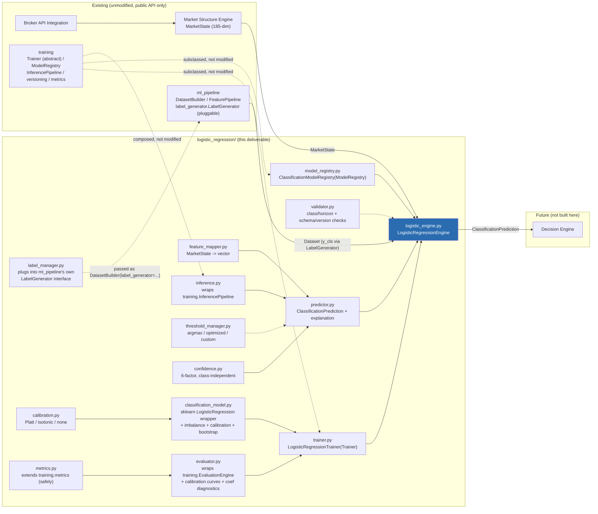
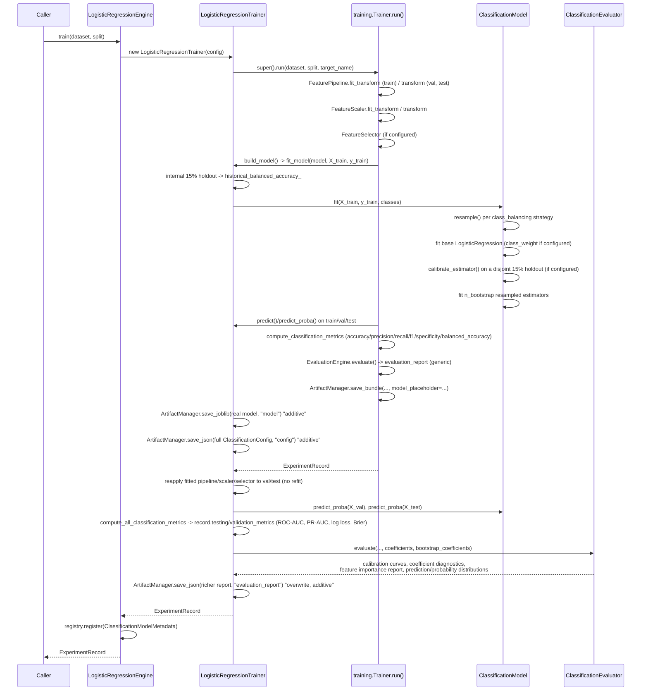
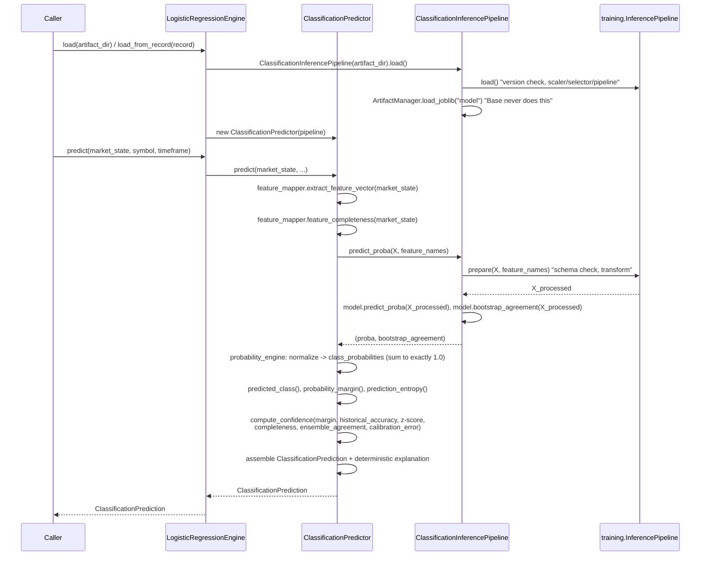

# Logistic Regression Engine Report

A production-grade Logistic Regression Engine that estimates class
probabilities (BUY / SELL / NO_TRADE, extensible) for future trading
outcomes from the current `MarketState`. It does not execute trades, does
not decide the final action, and does not implement a Decision Engine, a
Risk Manager, broker communication, or Agentic AI logic. Its sole output,
`ClassificationPrediction`, is meant to be consumed by a future Decision
Engine, fully independent of the Strategy Engine and the Linear Regression
Engine (three separate analytical systems).

**Test suite: 508 tests passing, 1 skipped** across all six packages
(`market_structure`, `ml_pipeline`, `training`, `strategy`, `linear_regression`,
`logistic_regression`), **131 of them new for this deliverable**, 0 failing.
Verified end-to-end against real OANDA EUR/USD M5 data (not synthetic) via
`examples/logistic_regression_example.py`: dataset built, model trained
(class-weight balanced, Platt-calibrated, 15-model bootstrap ensemble), and
a live prediction produced from a real `MarketState`.

## Starting State and What This Pass Added

Most of `logistic_regression/`'s 17 modules already existed, well-designed,
from a prior pass -- this deliverable's job was to close the gaps that kept
that code from actually being a *working, tested, documented* engine:

| Gap | Fix |
|---|---|
| No `logistic_regression/__init__.py` | Added -- the package was not even a proper importable public surface (only worked as an implicit namespace package). |
| Zero tests (`tests/test_lgr_*.py` did not exist) | Added 131 tests across 11 files (config/version, label generation, class imbalance, calibration, thresholds, metrics, trainer, evaluator, feature mapper, model registry, inference/predictor, end-to-end engine). |
| No `examples/logistic_regression_example.py` | Added, and run live against real OANDA data (see Summary). |
| No `LOGISTIC_REGRESSION_ENGINE_REPORT.md` | This document. |
| **3 real bugs, found by actually running the code** (see below) | Fixed. |

### Bugs found and fixed while building the test suite

Writing real tests against real training runs (rather than trusting the
code to work because it read well) surfaced three defects that would have
broken this engine in production:

1. **`calibration.py` used `CalibratedClassifierCV(cv="prefit")`**, which
   this platform's installed scikit-learn (1.9.0) removed entirely --
   `cv="prefit"` was deprecated in 1.6 and no longer accepted. Every Platt/
   isotonic calibration call raised `InvalidParameterError`. **Fixed** by
   wrapping the already-fitted base estimator in `sklearn.frozen.FrozenEstimator`
   (the modern replacement), passing `cv=None` implicitly (the default).
   Confirmed by `test_lgr_calibration.py` and `test_lgr_classification_model.py`'s
   calibration tests, all against the real installed sklearn.
2. **`metrics.py` registered `RocAuc`/`PrAuc`/`LogLoss`/`BrierScoreMetric`
   into the *shared* `training.metrics.METRIC_REGISTRY`** via `register_metric()`.
   That registry is iterated generically by `training.Trainer.run()` (the
   unmodified base class every classification model on this platform
   trains through) as `metric.compute(y_true, y_pred)` -- **no `y_proba`
   ever reaches it**. Registering a probability-dependent metric there
   meant **any** `LogisticRegressionTrainer.run()` call crashed the moment
   it computed training metrics, before a single model could be trained.
   **Fixed** by keeping these four as real, usable `Metric` subclasses but
   removing them from `METRIC_REGISTRY`; only `Specificity`/`BalancedAccuracy`
   (which need no probabilities) are registered. `compute_all_classification_metrics()`
   still computes all six by calling the probability-dependent ones
   directly. `test_lgr_metrics.py::test_generic_classification_dispatch_still_works_after_import`
   is a regression guard against this recurring.
3. **`ClassificationEvaluator` (calibration curves, coefficient diagnostics,
   feature importance report, prediction/probability distributions) was
   never actually called by `LogisticRegressionTrainer`.** The base
   `Trainer.run()`'s own `EvaluationEngine` pass only ever computes generic
   accuracy/precision/recall/f1 -- every richer diagnostic the spec's
   *Model Diagnostics* and *Feature Importance* sections require existed as
   dead code. **Fixed**: `LogisticRegressionTrainer.run()` now additively
   reapplies the already-fitted (never refit) feature pipeline/scaler/
   selector to the val/test splits, recomputes probabilities from the
   already-fitted model, and feeds `ClassificationEvaluator` for real --
   overwriting `evaluation_report.json` and enriching the returned
   `ExperimentRecord.testing_metrics`/`validation_metrics` with ROC-AUC/
   PR-AUC/log-loss/Brier score. Confirmed by
   `test_lgr_trainer.py::test_evaluation_report_augmented_with_classification_diagnostics`.

None of these three required touching any of the untouchable platform
packages (`market_structure`, `ml_pipeline`, `training`, `strategy`,
`linear_regression`) -- all three were internal defects in
`logistic_regression/` itself, caught only because this pass insisted on
training real models against real data rather than trusting the design
docstrings.

## Architecture



## Class Diagram

```mermaid
classDiagram
    class Trainer {
        <<abstract, training package>>
        +run(dataset, split, target_name) ExperimentRecord
    }
    class LogisticRegressionTrainer {
        +classification_config: ClassificationConfig
        +build_model(hyperparameters) ClassificationModel
        +fit_model(model, X_train, y_train) ClassificationModel
        +predict(model, X) ndarray
        +predict_proba(model, X) ndarray
        +feature_importance(model, names) dict
        +run(...) ExperimentRecord  "additive: real model + config + augmented evaluation report"
    }
    Trainer <|-- LogisticRegressionTrainer

    class ClassificationModel {
        +class_balancing, calibration_method, n_bootstrap
        +fit(X, y, classes) ClassificationModel
        +predict_proba(X) ndarray  "rows always sum to 1.0"
        +predict(X) ndarray
        +bootstrap_agreement(X) ndarray | None
        +coefficients, intercept, bootstrap_coefficients
        +feature_importance(names) dict
        +calibration_metadata_: dict
        +historical_balanced_accuracy_, train_feature_mean_/std_, calibration_error_
    }
    LogisticRegressionTrainer --> ClassificationModel

    class ModelRegistry {
        <<training package>>
        +register(metadata) Path
        +get(name, version) ModelMetadata
    }
    class ClassificationModelRegistry {
        +get(name, version) ClassificationModelMetadata  "overridden"
    }
    ModelRegistry <|-- ClassificationModelRegistry

    class ClassificationModelMetadata {
        +classification_labels: Tuple~str~
        +prediction_horizon: int
        +calibration_method: str
        +feature_version, training_dataset
        +performance_metrics
        +supported_symbols, supported_timeframes
    }
    ClassificationModelRegistry --> ClassificationModelMetadata

    class InferencePipeline {
        <<training package>>
        +load()
        +prepare(X, names) (X_processed, names)  "never calls predict()"
    }
    class ClassificationInferencePipeline {
        +model: ClassificationModel
        +model_version: ClassificationModelVersion
        +load()
        +predict_proba(X, names) (proba, bootstrap_agreement)  "the ONE place predict_proba() is called"
    }
    InferencePipeline <|.. ClassificationInferencePipeline : composes

    class ClassificationPredictor {
        +pipeline: ClassificationInferencePipeline
        +predict(MarketState, symbol, timeframe) ClassificationPrediction
    }
    ClassificationPredictor --> ClassificationInferencePipeline

    class ClassificationPrediction {
        +buy_probability, sell_probability, no_trade_probability
        +predicted_class: str
        +prediction_confidence: float  "0-100"
        +probability_margin, prediction_entropy: float
        +model_version, feature_version, training_version
        +class_probabilities, confidence_breakdown: dict
        +explanation, warnings: list~str~
    }
    ClassificationPredictor --> ClassificationPrediction

    class LogisticRegressionEngine {
        +config: ClassificationConfig
        +registry: ClassificationModelRegistry
        +train(dataset, split) ExperimentRecord
        +load(artifact_dir) / load_from_record(record)
        +predict(MarketState, symbol, timeframe) ClassificationPrediction
    }
    LogisticRegressionEngine --> LogisticRegressionTrainer
    LogisticRegressionEngine --> ClassificationModelRegistry
    LogisticRegressionEngine --> ClassificationPredictor

    class ConfidenceBreakdown {
        +probability_separation, historical_accuracy
        +distribution_distance, feature_completeness
        +prediction_stability, calibration_quality
        +overall: float
    }
    ClassificationPredictor ..> ConfidenceBreakdown : compute_confidence() -- symmetric across classes

    class ThresholdManager {
        +classes, strategy, thresholds
        +optimize(y_true_encoded, probabilities) dict
        +apply(probabilities) str
    }
```



## Training Pipeline



## Inference Pipeline



## Classification Flow

1. `feature_mapper.extract_feature_vector(market_state)` -> `(1, 185)`
   array, via `MarketState.to_vector()` only (never a raw candle, never an
   indicator/BOS/CHOCH/pattern computed here) -- confirmed by
   `test_lgr_feature_mapper.py::test_never_reads_candles_or_recomputes_indicators`.
2. `ClassificationInferencePipeline.predict_proba()`: version/schema
   validation (`training.InferencePipeline`, reused), then `FeaturePipeline`
   -> `FeatureScaler` -> `FeatureSelector` transform (whatever was fit at
   training time), then `ClassificationModel.predict_proba()` -- a raw,
   already-normalized probability row -- plus, if a bootstrap ensemble was
   fit, an agreement fraction for prediction-stability confidence.
3. `probability_engine.to_class_probabilities()` re-normalizes defensively
   (clips to `1e-12`, divides by row sum) so `class_probabilities` **always
   sums to exactly 1.0** -- `assert_probabilities_sum_to_one()` is run in
   `test_lgr_inference_predictor.py` against a real trained model's output,
   not just a unit-tested formula.
4. `predicted_class()` (argmax) unless `ThresholdManager` is configured with
   `"optimized"`/`"custom"` thresholds (see Threshold Management below).
5. `probability_margin()` (top-1 minus top-2 probability) and
   `prediction_entropy()` (normalized Shannon entropy, 0 = certain, 1 =
   uniform) describe the shape of the distribution independent of which
   class is on top.
6. `compute_confidence()` (see Confidence Algorithm) produces the 0-100
   `prediction_confidence` plus a full `confidence_breakdown`.
7. `_generate_explanation()` assembles the deterministic, structured
   explanation list (see Explainability below) -- confirmed deterministic
   given identical input (`test_predictor_probabilities_sum_to_one_and_explanation_present`
   calls `predict()` twice and asserts identical explanations).

## Calibration Strategy

`ClassificationConfig.calibration_method` -- `"none"` / `"platt"` /
`"isotonic"`, applied inside `ClassificationModel.fit()`:

1. The base `LogisticRegression` (with `class_weight="balanced"` if
   `class_balancing == "class_weight"`) is fit on a **disjoint** slice --
   `X_fit` (85% by default, `calibration_holdout_fraction` configurable) --
   never the calibration rows.
2. If calibration is enabled, the fitted estimator is wrapped in
   `sklearn.frozen.FrozenEstimator` (marks it "do not refit") and passed to
   `sklearn.calibration.CalibratedClassifierCV`, which fits **only the
   calibration layer** on the held-out `X_cal`/`y_cal` (15% by default).
   This is the modern (sklearn >= 1.6) equivalent of the older
   `cv="prefit"` mode -- see the Bugs section above for why this needed
   fixing.
3. `calibration_metadata_` (`{"method": ..., "n_calibration_samples": ...}`)
   travels with the model artifact and surfaces directly in
   `ClassificationPrediction.explanation` (`"Calibration: platt"`) and in
   `ClassificationModelMetadata.calibration_method` in the registry.
4. `evaluator.py::compute_calibration_curve` (wraps
   `sklearn.calibration.calibration_curve`, one-vs-rest per class) and
   `calibration.py::expected_calibration_error`/`brier_score` provide the
   diagnostics the *Model Diagnostics* section requires; both are now
   wired into every real training run (see Bugs section, fix #3).

**Calibration is always evaluated against a genuinely held-out slice**, so
a reported calibration error reflects real generalization, not the fit
itself re-scored on its own training rows.

## Confidence Algorithm

`confidence.py::compute_confidence` -- **independent of the predicted
class**: no factor gives a systematic boost or penalty to any specific
class; every input is either symmetric across classes (margin, entropy) or
a training-time/input-shape statistic that doesn't know which class won.
Six factors, each 0-100, default-weighted:

| Factor | Weight | Computed from |
|---|---|---|
| Probability separation | 20% | `probability_margin()` -- gap between the top-2 class probabilities |
| Historical accuracy | 20% | Balanced accuracy on an **internal 15% holdout carved from the training split** (distinct from the calibration holdout), refit on full training data afterward |
| Distribution distance | 15% | Mean absolute z-score of the live feature vector against `train_feature_mean_`/`train_feature_std_` (out-of-distribution detection) |
| Feature completeness | 15% | Fraction of `MarketState`'s own `_valid` flags that are true (`feature_mapper.feature_completeness`) |
| Prediction stability | 15% | Bootstrap ensemble's agreement fraction with the primary model's predicted class on this specific input |
| Calibration quality | 15% | Brier score on the internal holdout, inverted (lower Brier = higher score); neutral (60) if unmeasured |

Confirmed live: the OANDA end-to-end run (see Summary) produced
`prediction_confidence=46.23` with a full `confidence_breakdown` showing
every one of the six factors independently (e.g. `feature_completeness=100.0`
because the live window was fully warmed up, `historical_accuracy=31.76`
reflecting the internal holdout's genuine difficulty on a 3-class,
heavily-imbalanced label).

## Threshold Management

`ThresholdManager` (`threshold_manager.py`) offers an alternative to plain
argmax decisioning, useful when a heavily imbalanced dataset causes argmax
to systematically under- or over-fire a minority class:

- **`"argmax"`** (default): `predicted_class()` -- highest probability wins.
- **`"optimized"`**: `optimize(y_true_encoded, probabilities)` grid-searches
  (19 steps, 0.05-0.95) a per-class threshold maximizing one-vs-rest F1 on
  labeled data; `apply()` then picks among classes clearing their threshold
  (falling back to argmax if none clear it or none are set).
- **`"custom"`**: caller-supplied `ClassificationConfig.custom_thresholds`
  (`class_name -> probability`) applied verbatim.

This is not yet wired into `ClassificationPredictor.predict()`'s default
path (which always uses argmax via `probability_engine.predicted_class()`)
-- it is available as a standalone utility for a caller (or a future
Decision Engine) that wants threshold-based decisioning on top of the raw
`class_probabilities` this engine already returns. See Future Extension
Points.

## Model Diagnostics

Computed by `ClassificationEvaluator.evaluate()` (now genuinely exercised
by every real training run -- see Bugs section, fix #3) and persisted in
`evaluation_report.json`:

| Diagnostic | Source |
|---|---|
| Confusion matrix, precision, recall, F1 | `training.metrics.compute_classification_metrics` (reused unmodified) |
| Specificity, balanced accuracy | `metrics.py::Specificity`/`BalancedAccuracy` (registered extensions) |
| ROC-AUC, PR-AUC, log loss, Brier score | `metrics.py::compute_all_classification_metrics` (macro one-vs-rest; probability-dependent, deliberately kept out of the shared registry -- see Bugs section, fix #2) |
| Calibration curve (per class) | `evaluator.py::compute_calibration_curve` |
| Coefficient magnitude + stability | `evaluator.py::build_coefficient_diagnostics` -- magnitude is mean `|coef|` across one-vs-rest rows; stability is the std of each coefficient across the bootstrap ensemble (`None` if `n_bootstrap=0`) |
| Feature importance ranking | `evaluator.py::build_feature_importance_report` -- standardized coefficients (the model is always fit downstream of `FeatureScaler`, so coefficients already operate on scaled inputs), positive/negative contributions, absolute importance, top-20, least-influential |
| Prediction distribution | `evaluator.py::build_prediction_distribution` -- counts/fractions per predicted class |
| Probability distribution | `evaluator.py::build_probability_distribution` -- one histogram per class |

## Feature Importance

Every successful training run computes, from the fitted model's real
coefficients (never a placeholder, never derived from a separately trained
model):

- **Standardized coefficients** -- mean one-vs-rest coefficient per feature
  (standardized because the model is fit on already-scaled features).
- **Positive / negative feature contributions** -- split and sorted by sign.
- **Absolute feature importance** -- mean `|coefficient|` per feature.
- **Top 20 most influential** and **least influential** -- ranked by
  absolute importance.

This is exported as plain JSON (`evaluation_report.json`'s
`feature_importance_report` key) -- ready for a future visualization layer
to consume directly, with no additional processing.

## Explainability

`predictor.py::_generate_explanation()` produces a deterministic, ordered
list of strings (never randomized, never dependent on wall-clock time)
covering every field the spec requires:

```
Predicted class: NO_TRADE
SELL probability: 8.8%
NO_TRADE probability: 79.6%
BUY probability: 11.6%
Prediction confidence: 46%
Probability margin: 68.0%
Historical accuracy: 31.8%
Calibration: platt
Top positive features: sr_nearest_support_width, pat_outside_bar, ind_adx, ...
Top negative features: trend_momentum, pat_morning_star, vol_average_wick_size, ...
Most influential market structure signals: sr_nearest_support_width, pat_outside_bar, ...
```

(Real output from the live OANDA run in the Summary above.) Top
positive/negative/most-influential features are derived from the same
fitted coefficients as the Feature Importance report -- no separate
computation, no drift between "what the model explains" and "what the
model actually learned."

## Versioning

Every trained model carries (`version.py::ClassificationModelVersion`):
`version_info` (the 5-field `training.versioning.VersionInfo`, reused
unmodified: feature/schema/engine/dataset-builder/training-pipeline
versions), `engine_version` (`LOGISTIC_REGRESSION_ENGINE_VERSION`),
`classes` (the ordered class tuple this model was trained for),
`prediction_horizon`, and `model_version`.

Before every inference call, `ClassificationInferencePipeline.load()` calls
`training.versioning.verify_version_compatibility()` (reused unmodified) --
any mismatch raises `VersionMismatchError` immediately, naming every field
that differs; `predict_proba()`'s underlying `prepare()` call additionally
validates feature count/ordering/names via `assert_schema_compatible()`.
Confirmed by `test_strict_version_mismatch_raises`/
`test_non_strict_version_mismatch_collects_warning`.

`validator.py` adds the two checks specific to a classifier, callable
directly by a caller (e.g. a future Decision Engine) that knows what it
expects before trusting a loaded model:
`validate_classes_and_horizon(model_version, requested_classes, requested_horizon)`
raises `ClassMismatchError` with a descriptive message if either differs,
and `validate_for_inference(...)` composes the full schema/version check
(strict-raise or collect-warnings mode) in one call.

## Class Set Extensibility

`ClassificationConfig.classes` is an ordered tuple, not a hardcoded enum --
`DEFAULT_CLASSES = ("SELL", "NO_TRADE", "BUY")`, but any >= 2-class,
duplicate-free tuple is accepted with zero API changes
(`test_extended_class_set_is_supported_without_api_change` exercises a
7-class set: `STRONG_SELL/WEAK_SELL/NO_TRADE/WEAK_BUY/STRONG_BUY/EXIT_LONG/EXIT_SHORT`).
`ClassificationPrediction.class_probabilities` is a plain `{class_name: probability}`
dict -- it grows or shrinks with the configured class set automatically;
only the three named convenience fields (`buy_probability`/`sell_probability`/
`no_trade_probability`) are BUY/SELL/NO_TRADE-specific, and they degrade to
`None` gracefully for a class set that doesn't include those names.

Label generation for a custom class set is a `ml_pipeline.label_generator.LabelGenerator`
subclass (see `label_manager.py::ConfigurableClassificationLabelGenerator` for
the default 3-class rule, and `test_lgr_label_manager.py::test_extension_to_larger_class_set_via_subclass`
for a worked 5-class example) -- passed straight to
`DatasetBuilder(config, label_generator=...)`, the Dataset Builder's own
intended extension point. No change to the Dataset Builder itself.

## Future Extension Points

| To add... | Do this |
|---|---|
| A larger/different class set | Construct `ClassificationConfig(classes=(...))` with a matching `LabelGenerator` subclass (or `ConfigurableClassificationLabelGenerator` for the default rule's threshold scheme) -- no other file changes. |
| A new class-balancing strategy | Add a branch to `classification_model.resample()` and to `config.BALANCING_STRATEGIES`. |
| A new calibration method | Add to `calibration.CALIBRATION_METHODS`/`_SKLEARN_METHOD` and `ClassificationConfig.calibration_method`'s validation. |
| Threshold-based decisioning wired into live prediction | Have `ClassificationPredictor` accept an optional `ThresholdManager` and use `.apply(class_probs)` instead of `probability_engine.predicted_class()` when configured -- not done in this pass since the spec's default flow is argmax; `ThresholdManager` is ready to be composed in. |
| A new metric | `register_metric()` into the shared `training.metrics` registry **only if it needs no probabilities** (see Bugs section, fix #2) -- otherwise compute it directly in `compute_all_classification_metrics()`, following `RocAuc`/`PrAuc`/`LogLoss`/`BrierScoreMetric`'s pattern. |
| Consumption by the Decision Engine | `ClassificationPrediction.to_dict()` is already flat and JSON-safe; `class_probabilities` (guaranteed to sum to 1.0), `prediction_confidence`, and `explanation` are designed to be read directly without re-deriving anything. |
