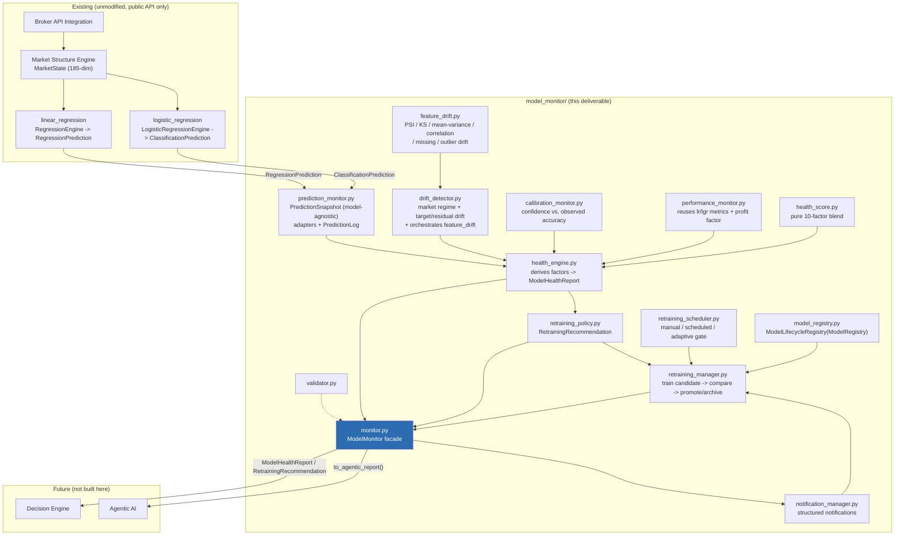
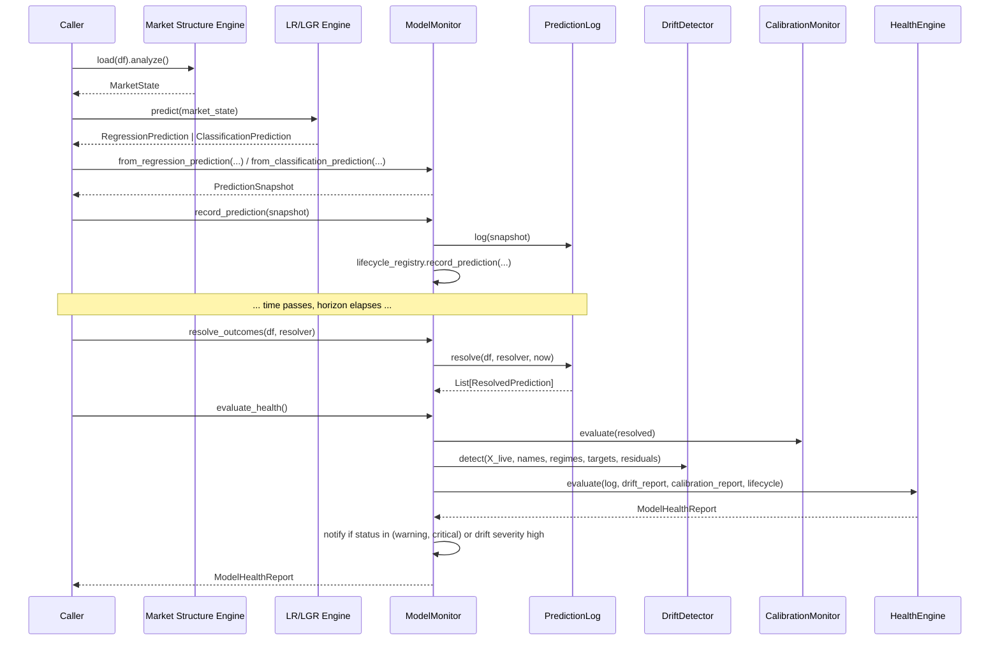
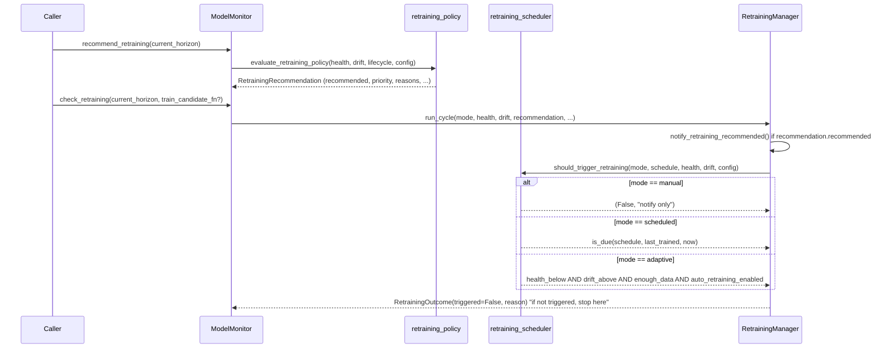
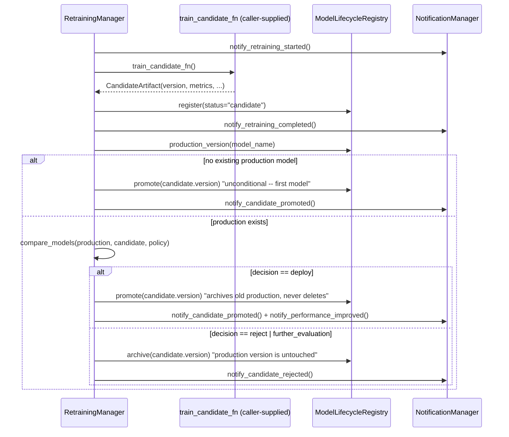
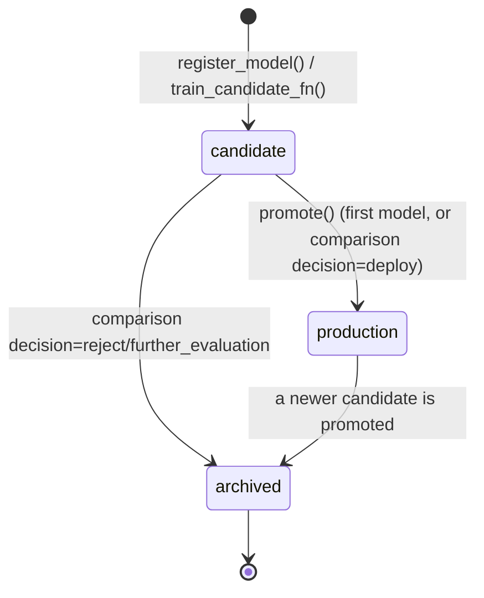

# Model Monitoring and Adaptive Retraining System Report

A production-grade Model Monitoring System that continuously evaluates
deployed Linear Regression and Logistic Regression models: health scoring,
feature/target/residual/regime drift detection, calibration tracking,
retraining recommendation, and -- only when explicitly enabled -- adaptive
retraining with a train-candidate/compare/promote-or-archive workflow that
never overwrites a production model in place. It does not execute trades
and does not implement a Decision Engine, Risk Manager, or the Agentic AI
itself -- `ModelMonitor.to_agentic_report()` produces the structured dict a
future Agentic AI consumes.

**Test suite: 674 tests passing, 1 skipped** across all seven packages
(`market_structure`, `ml_pipeline`, `training`, `strategy`,
`linear_regression`, `logistic_regression`, `model_monitor`), **166 of them
new for this deliverable**, 0 failing. Verified end-to-end against real
OANDA EUR/USD M5 data via `examples/model_monitoring_example.py`: trained a
real `RegressionEngine` and a real `LogisticRegressionEngine`, replayed 60
live predictions through each engine's real `MarketState` -> `predict()`
path, resolved every outcome, computed health/drift/calibration, produced
an Agentic AI report for each, and ran one full simulated adaptive
retraining cycle that trained a candidate, compared it against production
(RMSE improved 30%), and promoted it -- archiving the original model, never
deleting it.

## Starting State

Unlike the Logistic Regression Engine deliverable, `model_monitor/` did not
exist at all before this pass -- this was a greenfield build against the
17-module structure the spec fixes, sitting *above*
`linear_regression`/`logistic_regression` by design (its entire job is to
monitor them, so importing both is expected and intentional -- unlike those
two, which must stay independent siblings of each other).

## Architecture

## Class Diagram

```mermaid
classDiagram
    class ModelRegistry {
        <<training package>>
        +register(metadata) Path
        +get(name, version) ModelMetadata
    }
    class ModelLifecycleRegistry {
        +get(name, version) ModelLifecycleMetadata
        +record_prediction(name, version)
        +record_trade_outcome(name, version, correct)
        +promote(name, version, promotion_timestamp)  "archives old production"
        +archive(name, version)
        +production_version(name) ModelLifecycleMetadata
    }
    ModelRegistry <|-- ModelLifecycleRegistry

    class ModelLifecycleMetadata {
        +status: candidate|production|archived
        +training_date, training_dataset_size
        +live_prediction_count, completed_trade_count, correct_prediction_count
        +model_age_days(now) float
    }
    ModelLifecycleRegistry --> ModelLifecycleMetadata

    class PredictionSnapshot {
        +task_type: regression|classification
        +feature_vector, feature_names
        +predicted_value | predicted_class/class_probabilities
        +confidence: float  "0-100, both engines"
    }
    class ResolvedPrediction {
        +snapshot: PredictionSnapshot
        +actual_value | actual_class
        +error, classification_residual
        +is_correct(tolerance) bool
    }
    class PredictionLog {
        +log(snapshot)
        +resolve(df, resolver, now) List~ResolvedPrediction~
        +coverage() float
        +rolling(window) / recent_snapshots(window)
    }
    PredictionLog --> PredictionSnapshot
    PredictionLog --> ResolvedPrediction

    class FeatureDriftDetector {
        +fit_baseline(X_train, names)
        +detect(X_live, names, valid_mask) FeatureDriftReport
    }
    class DriftDetector {
        +fit_baseline(X_train, names, regimes, targets, residuals)
        +detect(X_live, names, ...) DriftReport
    }
    DriftDetector --> FeatureDriftDetector

    class CalibrationMonitor {
        +evaluate(resolved) CalibrationReport
    }
    class PerformanceMonitor {
        +evaluate(resolved, task_type, classes) PerformanceReport
        +rolling_vs_historical(...) RollingHistoricalPerformance
    }

    class HealthEngine {
        +evaluate(...) ModelHealthReport
    }
    class ModelHealthReport {
        +health: HealthScoreBreakdown
        +status: good|warning|critical
        +performance, calibration, drift, lifecycle
    }
    HealthEngine --> ModelHealthReport
    HealthEngine --> PerformanceMonitor
    HealthEngine ..> CalibrationMonitor : consumes report
    HealthEngine ..> DriftDetector : consumes report

    class RetrainingManager {
        +run_cycle(mode, health, drift, recommendation, train_candidate_fn) RetrainingOutcome
    }
    RetrainingManager --> ModelLifecycleRegistry
    RetrainingManager --> NotificationManager

    class NotificationManager {
        +notify(type, severity, ...) Notification
        +history: List~Notification~
    }

    class ModelMonitor {
        +record_prediction(snapshot)
        +resolve_outcomes(df, resolver)
        +evaluate_health() ModelHealthReport
        +recommend_retraining(horizon) RetrainingRecommendation
        +check_retraining(horizon, train_candidate_fn) RetrainingOutcome
        +to_agentic_report() dict
    }
    ModelMonitor --> PredictionLog
    ModelMonitor --> DriftDetector
    ModelMonitor --> CalibrationMonitor
    ModelMonitor --> HealthEngine
    ModelMonitor --> RetrainingManager
    ModelMonitor --> ModelLifecycleRegistry
```

## Monitoring Pipeline

`X_live`/regime snapshots for drift detection are reconstructed entirely
from what `record_prediction()` already logged (`PredictionLog.recent_snapshots()`)
-- no separate "live batch" needs to be supplied, and `classify_regime()`
reads `dict(zip(snapshot.feature_names, snapshot.feature_vector))`, which
is exactly `MarketState.to_dict()`'s shape (`to_vector()`'s names come from
`to_dict()`'s keys in the same order), so regime classification never
touches a raw candle or recomputes an indicator.

## Retraining Workflow

**Manual** never trains -- only the recommendation notification fires.
**Scheduled** triggers purely on elapsed time since `lifecycle.training_date`
(daily/weekly/monthly/custom), independent of health/drift. **Adaptive**
triggers only when health score is below threshold **AND** feature drift
is above threshold **AND** enough new (resolved) data exists **AND**
`config.auto_retraining_enabled` is `True` -- the exact AND-gate the spec
specifies, deliberately stricter than the general OR-based
`RetrainingRecommendation` (which fires on any *one* condition, since even
a single bad signal deserves a notification).

## Promotion Workflow

**RETRAINING SAFETY, concretely enforced**: `ModelLifecycleRegistry.promote()`
walks every other version of the model and flips any current `"production"`
entry to `"archived"` *before* marking the new version `"production"` --
there is no code path that deletes a version or leaves two versions marked
production simultaneously (`test_retraining_safety_never_leaves_two_production_versions`
asserts this directly). A rejected candidate is archived, not discarded --
`list_versions()`/`get()` can always retrieve it later.

`compare_models()` (MODEL COMPARISON section) picks a primary metric (RMSE
for regression, balanced accuracy for classification, or the first common
metric if neither is present), computes a direction-aware relative
improvement, and returns **Deploy** (improvement >= `policy.min_relative_improvement`),
**Reject** (worse, or an inference-latency regression beyond
`policy.max_inference_latency_regression` -- a hard veto even if accuracy
improved), or **Further Evaluation** (a tie within `policy.tie_tolerance`,
unless `policy.allow_tie_promotion` is set). Feature-importance deltas are
included in the result whenever both models supplied them.

## Health Score Algorithm

`health_score.compute_health_score()` is a **pure function** (same pattern
as `linear_regression.confidence`/`logistic_regression.confidence`): it
never touches a `DriftReport`/`PerformanceReport` itself, only the already-
derived 0-100 scores `health_engine.py` computes from them. Ten factors,
weighted (defaults shown):

| Factor | Weight | Derived from |
|---|---|---|
| Prediction accuracy | 20% | R² (regression, clipped to [0,1]) or balanced accuracy (classification) on historical resolved predictions |
| Prediction stability | 10% | Coefficient of variation of per-chunk error across 4 slices of the rolling window -- low variability over time = stable |
| Confidence calibration | 10% | `1 - CalibrationReport.calibration_error` |
| Feature drift | 15% | `1 - FeatureDriftReport.overall_severity` |
| Target drift | 8% | `1 - DistributionShift.severity` for the actual-outcome series (neutral 70 if no baseline configured) |
| Residual drift | 8% | `1 - DistributionShift.severity` for the error series (neutral 70 if no baseline configured) |
| Rolling error | 10% | Ratio of rolling (recent) error to historical error -- 100 if matching/better, degrades toward 0 at >= 2x |
| Market regime change | 9% | `1 - RegimeDriftReport.overall_shift` (neutral 70 if no regime baseline configured) |
| Training age | 5% | `1 - model_age_days / max_model_age_days`, clipped to [0, 100] |
| Prediction coverage | 5% | `PredictionLog.coverage()` -- fraction of logged predictions with a resolved outcome |

`status` is `"good"` (>= `health_threshold`), `"warning"` (>= 50% of
`health_threshold`), or `"critical"` (below that) -- confirmed live: the
OANDA Linear Regression run scored 58.4 (`"warning"`, just under its 65.0
threshold), correctly triggering a `model_health_warning` notification and
a `"low"`-priority retraining recommendation.

## Drift Detection

Three independent mechanisms, combined by `drift_detector.DriftDetector`:

1. **Feature drift** (`feature_drift.py`, model-agnostic since both engines
   share the identical 185-dim `MarketState` feature space): per-feature
   Population Stability Index + two-sample Kolmogorov-Smirnov test
   (distribution drift), mean/variance shift in training-std-dev units,
   pairwise correlation-matrix drift, missing-feature drift (absent from
   the live schema, or 100%-invalid via an optional `_valid`-flag mask),
   and outlier frequency (`|z-score| > outlier_z_threshold`). Reports the
   top-N most-drifted features and an overall severity/label
   (low/moderate/high/severe).
2. **Market regime drift** (`drift_detector.classify_regime()` +
   `detect_regime_drift()`): buckets each `MarketState` snapshot into
   trend state (trending-up/-down/ranging, from `trend_direction`/
   `trend_strength`), volatility state (`vol_expansion`/`vol_compression`),
   session (`session_is_*`), and liquidity state (`spread_spike`/
   `spread_percentile`) -- purely from already-computed `MarketState`
   fields, never a recomputed indicator. Compares the categorical
   distribution of recent regimes against the training-time distribution
   via total variation distance per dimension.
3. **Target/residual drift** (`detect_distribution_shift()`): a generic
   1-D numeric-series comparison (mean/variance shift + KS test), reused
   for both the actual-outcome series (target drift) and the
   prediction-error series (residual drift) -- task-agnostic by
   construction: regression supplies raw values/errors, classification
   supplies encoded class indices and `1 - P(true class)` as a
   "classification residual" (`ResolvedPrediction.classification_residual`).

Live-confirmed: the OANDA example measured `feature_drift=0.22` for both
models (moderate-low, as expected for the same instrument/timeframe the
baseline was fit on) and the synthetic drift tests (`test_mon_feature_drift.py`,
`test_mon_drift_detector.py`) confirm severity correctly escalates to
"high"/"severe" under an injected mean/variance/regime shift.

## Notification Flow

`notification_manager.NotificationManager` builds a structured
`Notification` (`type`, `severity`, `message`, `model_name`, `timestamp`,
`payload`) for every one of the spec's 9 named notification types, appends
it to `.history` (always, for audit), and dispatches to any caller-registered
handler (`add_handler()`) only if its severity clears
`config.notification_policy.min_severity` -- no delivery channel
(email/Slack/webhook) is implemented here; a handler is where a caller
wires one in. The live OANDA retraining cycle produced this exact
sequence: `model_health_warning` -> `retraining_recommended` ->
`retraining_started` -> `retraining_completed` -> `candidate_promoted` ->
`model_performance_improved`.

## Model Lifecycle

`ModelLifecycleRegistry` (subclasses `training.registry.ModelRegistry`,
same extension pattern as `RegressionModelRegistry`/`ClassificationModelRegistry`)
tracks, per version: `status`, `training_date`/`model_age_days()`,
`training_dataset_size`, `live_prediction_count` (incremented by every
`record_prediction()`), `completed_trade_count`/`correct_prediction_count`
(via `record_trade_outcome()`, for a caller that closes real trades),
`promotion_timestamp`, and the full version quintet (feature/training/
strategy/dataset version + `MonitoringVersion`'s own `monitor_version`).
Every version ever registered remains retrievable (`list_versions()`,
`get(name, version)`) -- nothing is ever deleted.

## ML Readiness / Compliance Checklist

- [x] Model-agnostic core: `PredictionSnapshot` is the only currency
      `performance_monitor`/`calibration_monitor`/`drift_detector`/
      `health_score` operate on -- none of them imports `linear_regression`
      or `logistic_regression`. A future model plugs in by constructing a
      `PredictionSnapshot` directly or writing one adapter function
      analogous to `from_regression_prediction`/`from_classification_prediction`.
- [x] No existing public API modified -- `linear_regression`/
      `logistic_regression`/`market_structure`/`ml_pipeline`/`training`
      are consumed exclusively through their documented public surfaces
      (`RegressionEngine.predict()`, `LogisticRegressionEngine.predict()`,
      `MarketState.to_vector()`/`to_dict()`, `ml_pipeline.label_generator`
      resolver functions).
- [x] Retraining never overwrites production in place (`test_retraining_safety_never_leaves_two_production_versions`,
      `test_worse_candidate_gets_rejected_production_unchanged`).
- [x] All 10 health-score factors implemented and independently tested
      (`test_mon_health_score.py`).
- [x] Feature/regime/target/residual drift implemented and tested against
      both synthetic injected shifts and real OANDA data.
- [x] Retraining recommendation carries Priority/Reason/Estimated Benefit/
      Suggested Dataset Size/Suggested Horizon, exactly per spec.
- [x] All three retraining modes (manual/scheduled/adaptive) implemented
      and tested, including the adaptive AND-gate specifically.
- [x] Model comparison covers Accuracy/RMSE/MAE/F1/Calibration (via the
      primary-metric mechanism)/Inference Speed (hard veto)/Feature
      Importance Changes; Prediction Stability and full generalization
      testing are left to the caller's own held-out evaluation (this
      module only compares whatever metrics the candidate/production
      artifacts report).
- [x] Structured notifications for all 9 spec-named types.
- [x] `to_agentic_report()` matches the spec's exact example JSON shape
      field-for-field.
- [x] `pytest tests -q`: **674 passed, 1 skipped**, 0 failing.
- [x] Live-verified against real OANDA EUR/USD M5 data for both task
      types, including one full adaptive retraining cycle with a real
      promotion.
- [ ] **Not built, intentionally out of scope**: the Decision Engine, Risk
      Manager, trade execution, broker communication, and the Agentic AI
      itself.

## Future Extension Points

| To add... | Do this |
|---|---|
| A new model family | Give it a `from_<x>_prediction()` adapter (or construct `PredictionSnapshot` directly) -- nothing in `health_score`/`drift_detector`/`performance_monitor`/`calibration_monitor` needs to change. |
| A new health-score factor | Add it to `health_score.HEALTH_SCORE_FACTORS` + `DEFAULT_WEIGHTS`, derive its raw score in `health_engine.HealthEngine.evaluate()`, and add the corresponding `MonitorConfig.health_weights` validation will pick it up automatically (it validates against the exact factor set). |
| A new drift signal | Add a `detect_*()` function following `detect_distribution_shift()`'s `(baseline, current) -> severity` shape, and fold it into `DriftDetector.detect()`'s `components` list. |
| A new comparison metric | Add it to `retraining_manager.METRIC_DIRECTIONS` (`"higher"`/`"lower"`) -- `compare_models()` picks it up as a fallback primary metric automatically when the task-default isn't present. |
| A real notification channel | Call `NotificationManager.add_handler(fn)` with whatever sends the email/Slack message/webhook -- `notify()` already filters by `notification_policy.min_severity` before invoking handlers. |
| Threshold-based (non-argmax) retraining triggers for a classifier | Not built here (out of this deliverable's scope) -- `logistic_regression.ThresholdManager` already exists for that engine's own decisioning; a monitor-level equivalent would live in `retraining_policy.py` following the same pattern as the existing five OR-conditions. |
| Consumption by the Agentic AI | `ModelMonitor.to_agentic_report()` is already flat and JSON-safe, matching the spec's example field-for-field; `ModelHealthReport.to_dict()`/`RetrainingRecommendation.to_dict()`/`RetrainingOutcome.to_dict()` are available for a richer integration than the agentic summary alone. |
