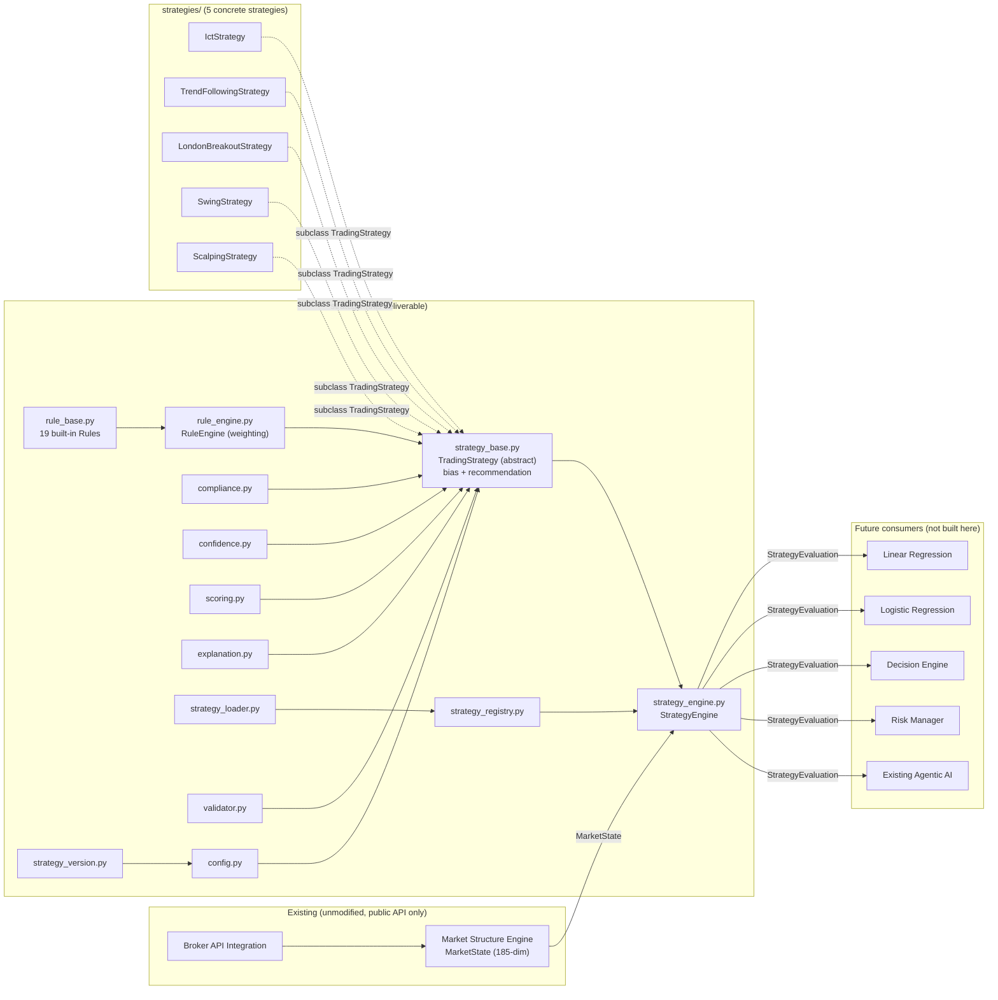
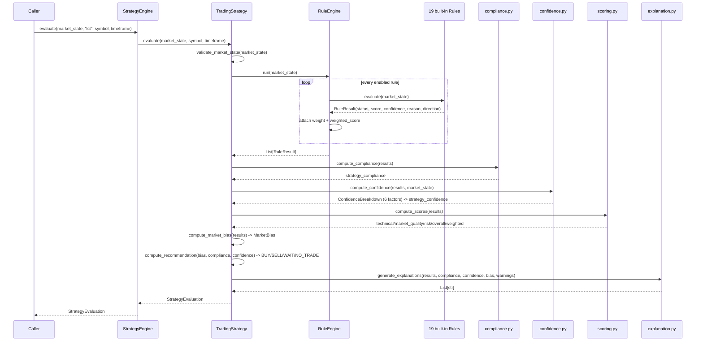
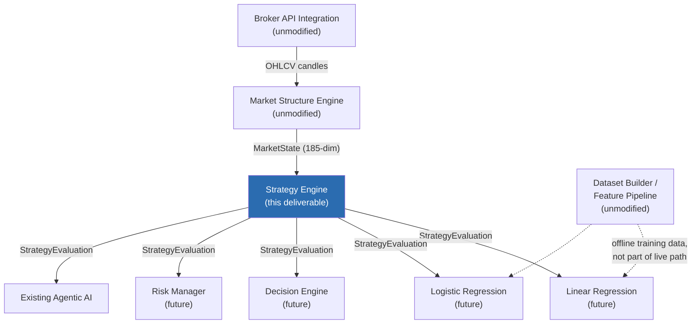

# Strategy Engine Report

A model-agnostic, rule-based Strategy Engine that evaluates live `MarketState`
(produced by the unmodified Market Structure Engine) against configurable
trading strategies. It executes no trades, talks to no broker, and implements
no machine learning -- its sole output, `StrategyEvaluation`, is meant for
downstream consumption by a future Linear/Logistic Regression model, Decision
Engine, Risk Manager, or the existing Agentic AI.

**Test suite: 310 tests passing** across all four packages (`market_structure`,
`ml_pipeline`, `training`, `strategy`), 104 of them new for this deliverable,
0 failing. Verified end-to-end against real OANDA EUR/USD M5 data (not
synthetic) via `examples/strategy_evaluation_example.py`.

## Architecture



## Class Diagram

```mermaid
classDiagram
    class Rule {
        <<abstract>>
        +name: str
        +category: str
        +evaluate(MarketState) RuleResult
    }
    class RuleResult {
        +rule_name, category, status
        +score: float [0-100]
        +confidence: float [0-100]
        +reason: str
        +weight, weighted_score
        +metadata: dict  "direction" key
    }
    class RuleEngine {
        +specs: List~RuleSpec~
        +run(MarketState) List~RuleResult~
    }
    class RuleSpec {
        +rule: Rule
        +weight: float
        +enabled: bool
    }
    class TradingStrategy {
        <<abstract>>
        +config: StrategyConfig
        +build_rules() Dict~str,Rule~  *abstract*
        +evaluate(MarketState) StrategyEvaluation
    }
    class StrategyEvaluation {
        +strategy_name, strategy_version, timestamp
        +symbol, timeframe
        +market_bias, recommendation
        +strategy_compliance, strategy_confidence
        +technical/market_quality/risk/overall_score
        +rule_results, rules_passed/failed/not_applicable
        +weighted_score, warnings, explanations
    }
    class StrategyConfig {
        +strategy_name, versions
        +rule_weights: Dict~str,float~
        +enabled_rules: Dict~str,bool~
        +rule_params: Dict~str,dict~
        +compliance_threshold, confidence_threshold
    }
    class StrategyEngine {
        +registry: StrategyRegistry
        +register_strategy(TradingStrategy)
        +evaluate(MarketState, name) StrategyEvaluation
        +evaluate_all(MarketState) Dict
    }
    class StrategyRegistry {
        +register(name, cls)
        +get(name) Type~TradingStrategy~
    }
    class StrategyLoader {
        +save(StrategyConfig) Path
        +load_config(name, version) StrategyConfig
        +build(class_name, config) TradingStrategy
    }
    class ConfidenceBreakdown {
        +rule_certainty, indicator_agreement
        +trend_consistency, volatility_stability
        +market_structure_quality, signal_stability
        +overall: float
    }
    class ScoreBreakdown {
        +technical_score, market_quality_score
        +risk_quality_score, overall_score, weighted_score
    }

    Rule <|-- TrendRule
    Rule <|-- EmaAlignmentRule
    Rule <|-- BreakOfStructureRule
    Rule <|-- RiskRule
    Rule <|-- "... 15 more built-in rules"

    RuleEngine o-- RuleSpec
    RuleSpec o-- Rule
    TradingStrategy o-- RuleEngine
    TradingStrategy o-- StrategyConfig
    TradingStrategy ..> StrategyEvaluation : produces
    TradingStrategy ..> ConfidenceBreakdown : uses
    TradingStrategy ..> ScoreBreakdown : uses
    StrategyEvaluation o-- RuleResult
    StrategyEngine o-- TradingStrategy
    StrategyEngine o-- StrategyRegistry
    StrategyLoader o-- StrategyRegistry
    StrategyLoader ..> StrategyConfig

    IctStrategy --|> TradingStrategy
    TrendFollowingStrategy --|> TradingStrategy
    LondonBreakoutStrategy --|> TradingStrategy
    SwingStrategy --|> TradingStrategy
    ScalpingStrategy --|> TradingStrategy
```

## Rule Flow



Every rule reads only `MarketState` sub-objects (`trend`, `structure`, `zones`,
`liquidity`, `fvg`, `order_blocks`, `spread`, `session`, `volatility`,
`microstructure`, `price_action`, `indicators`, `indicator_validity`) --
verified by `test_every_builtin_rule_returns_valid_result_on_real_market_state`,
which runs all 19 rules against a real engine-produced `MarketState` and
asserts a well-formed `RuleResult` every time, including graceful
`NOT_APPLICABLE` handling when a `_valid` flag is 0 or no zone/gap/block
exists yet (the Market Structure Engine's own missing-value convention,
consumed here rather than reinterpreted).

## Compliance Algorithm

`compliance.py::compute_compliance` -- **"how well is the market satisfying
this strategy, of the rules that could actually fire right now":**

```
applicable = [r for r in rule_results if r.status != NOT_APPLICABLE]
compliance = sum(r.weight * r.score for r in applicable) / sum(r.weight for r in applicable)
```

`NOT_APPLICABLE` rules are excluded from *both* numerator and denominator, so
a strategy isn't penalized just because (say) no order block exists yet --
weight renormalizes among whatever did run. Real example (ICT strategy, live
EUR/USD M5, all 9 configured rules applicable that bar): compliance = 58.42,
computed from 5 PASS + 4 FAIL rule scores weighted exactly as configured
(20/15/15/15/10/10/5/5/5) -- verified by hand against the JSON in
`examples/strategy_evaluation_example.py`'s output.

Two related-but-distinct numbers live in `scoring.py` instead of here:
- **`weighted_score`** uses the *same* numerator but divides by the *full*
  configured weight (100), so `NOT_APPLICABLE` rules still cost the strategy
  something -- it answers "how well is the market satisfying the *complete,
  as-authored* rule set," not just the applicable subset.
- **`overall_score`** is a second-stage blend of the three *category* scores
  (technical/market_quality/risk, default 50/30/20), independent of how many
  rules happen to fall in each category.

## Confidence Algorithm

`confidence.py::compute_confidence` -- **deliberately independent of
compliance**, blended from six differently-sourced factors (weights in
parentheses):

| Factor | Weight | Source |
|---|---|---|
| Rule certainty | 25% | Mean of each applicable rule's own `confidence` |
| Indicator agreement | 20% | Fraction of directional rules agreeing with the majority direction |
| Trend consistency | 15% | `MarketState.trend.strength` (0 if trend invalid) |
| Volatility stability | 15% | `MarketState.volatility.expansion/compression` (expansion = least stable) |
| Market structure quality | 15% | Freshness + strength of the last confirmed BOS |
| Signal stability | 10% | Whether trend direction agrees with the last BOS direction |

A strategy can be highly compliant but low-confidence -- e.g. every rule
agrees (high compliance) but the market is in a volatility-expansion regime
with a stale, weak BOS (low confidence), meaning that agreement is fragile.
Confirmed by `test_confidence_is_not_identical_to_compliance` and visible in
the live example: ICT's compliance (58.4) and confidence (69.1) differ by
more than 10 points on the same evaluation, computed from non-overlapping
inputs.

## Strategy Registry

`strategy_registry.py::StrategyRegistry` is a plain name -> class lookup
(same pattern as `training.registry.ModelRegistry` and
`ml_pipeline.label_generator`'s classification registry already in this
codebase). `default_registry()` lazily imports and registers the 5 built-in
strategies (`ict`, `trend_following`, `london_breakout`, `swing`, `scalping`)
the first time it's called, avoiding a circular import between `strategy/`
and the top-level `strategies/` package. `StrategyEngine` wraps a registry
plus a set of *already-configured* strategy instances ready for repeated,
in-memory, per-candle evaluation -- registering a class and registering a
runnable instance are deliberately separate concerns.

## Versioning

Every strategy carries four independent version numbers plus a timestamp
(`strategy_version.py::StrategyVersion`): `strategy_name`, `strategy_version`,
`rule_version` (defaults to `RULE_LIBRARY_VERSION`, bumped when a built-in
rule's pass/fail logic changes), `configuration_version`, and `timestamp`.
All three semantic-version fields are validated (`X.Y.Z`), and
`bump_version()` increments major/minor/patch. `StrategyConfig` stores the
same three version strings directly (so a saved/loaded configuration is
self-describing), and `StrategyLoader` persists configurations under
`{name}__{version}.json`, keeping every historical version on disk with an
index for fast "give me the latest" or "give me v1.0.0 specifically" lookups
-- exactly the `training.registry.ModelRegistry` pattern, applied to
strategies instead of trained models.

## Configuration Examples

**The spec's own worked example**, exactly as shipped in `strategies/ict_strategy.py`:

```python
DEFAULT_WEIGHTS = {
    "trend": 20.0, "break_of_structure": 15.0, "liquidity_sweep": 15.0,
    "order_block": 15.0, "ema_alignment": 10.0, "rsi": 10.0,
    "macd": 5.0, "session": 5.0, "spread": 5.0,
}  # sums to exactly 100.0, enforced by validator.validate_weights
```

**Disabling a rule and adjusting a threshold** (no code changes needed):

```python
from strategy import StrategyConfig
from strategies.ict_strategy import IctStrategy, default_config

cfg = default_config()
cfg.enabled_rules["spread"] = False       # skip the spread rule entirely
cfg.compliance_threshold = 80.0            # require a stricter compliance bar
strategy = IctStrategy(cfg)                # rebuilds its RuleEngine with 8 active rules
```

**Saving and loading a named, versioned configuration:**

```python
from strategy import StrategyLoader

loader = StrategyLoader("my_trading_config")
loader.save(cfg)                                   # writes ict__1.0.0.json + index.json
restored = loader.load_config("ict")                # latest version by default
strategy = loader.build("ict", config_name="ict")   # class lookup + config -> ready instance
```

**Live, in-memory, per-candle evaluation** (the required operating mode):

```python
from strategy import StrategyEngine, default_registry

engine = StrategyEngine(default_registry())
engine.register_strategy(strategy)

# On every new candle:
market_state = mse_engine.analyze()   # Market Structure Engine, unmodified
evaluation = engine.evaluate(market_state, "ict", symbol="EUR_USD", timeframe="M5")
```

## Integration Diagram



The Strategy Engine sits strictly between the Market Structure Engine and
every downstream consumer. It never calls back into the Broker API or the
Dataset Builder -- both are shown only to make the full platform topology
clear.

## Future Extension Points

Every one of these is additive -- no existing file needs to change:

| To add... | Do this |
|---|---|
| A new rule | Subclass `Rule` in (or alongside) `rule_base.py`, add it to `BUILTIN_RULES`. Any strategy can reference it by name in `rule_weights` immediately. |
| A new strategy | Subclass `TradingStrategy`, implement `build_rules()` (typically just `return build_all_rules(self.config.rule_params)`), add a `default_config()` factory, register it with `StrategyRegistry.register()`. |
| A new confidence factor | Add a component function in `confidence.py` and a weight in `ConfidenceBreakdown.overall` -- existing factors and their weights are untouched. |
| A different bias/recommendation policy | `compute_market_bias`/`compute_recommendation` in `strategy_base.py` are free functions, not methods -- swap them per-strategy by overriding, or parametrize further without touching `TradingStrategy.evaluate()`'s orchestration. |
| Per-symbol/timeframe strategy variants | `StrategyConfig.symbol`/`.timeframe` are already descriptive fields; `StrategyLoader` already supports multiple named/versioned configs per strategy class -- save one config per symbol and pick the right one at evaluation time. |
| Consumption by a future ML model | `StrategyEvaluation.to_dict()` is already flat and JSON-safe; `rule_results` gives per-rule scores/confidences a model could use as engineered features alongside the raw 185-dim `MarketState` vector. |

## What Was Deliberately Not Built

Per the task's explicit scope: no trade execution, no broker communication,
no Linear/Logistic Regression, no Decision Engine, no Risk Manager. The
`"risk"`-category rules (`AtrRule`, `SpreadRule`, `VolatilityRule`, `RiskRule`)
feed `risk_quality_score` and can force `NO_TRADE`, but that is a
market-condition gate computed from `MarketState` alone -- not position
sizing, stop placement, or any other Risk Manager responsibility. The
`recommendation` field (`BUY`/`SELL`/`WAIT`/`NO_TRADE`) is produced by the
explicit, auditable, deterministic function `compute_recommendation()` in
`strategy_base.py` -- never a trained model.
