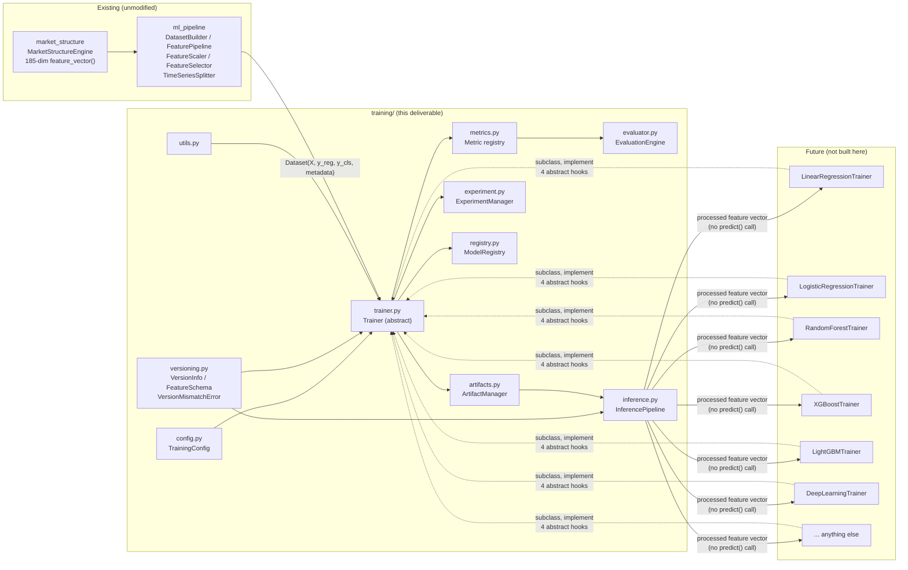
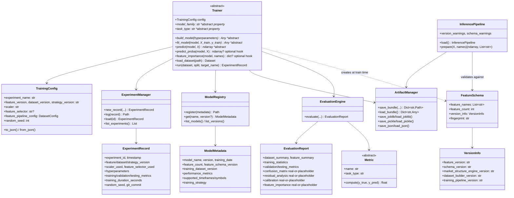
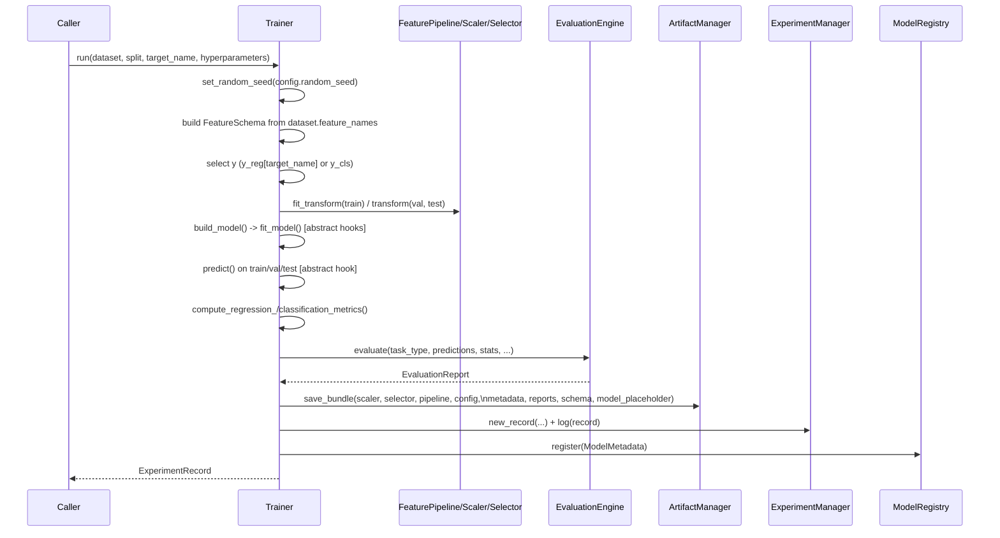
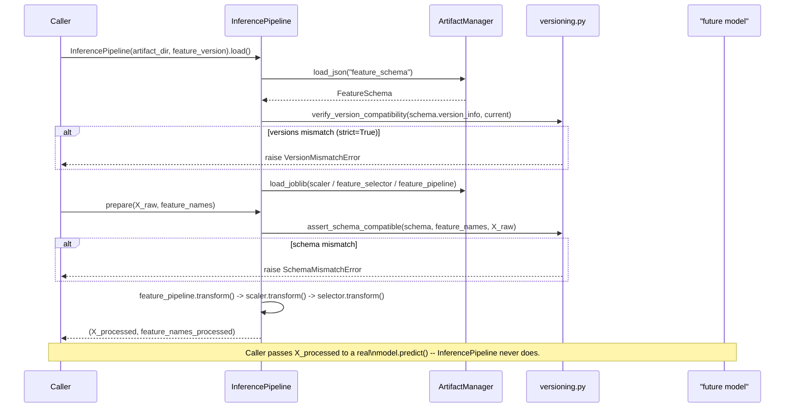

# Training Infrastructure Report

Model-agnostic machine learning training infrastructure (`training/`) built on top
of the existing, unmodified **Market Structure Engine** (`market_structure/`) and
**Dataset Builder / Feature Pipeline** (`ml_pipeline/`). This package implements
**no machine learning algorithm** -- `Trainer` is abstract. Everything below was
verified end-to-end with a pair of trivial test-only stub trainers (a mean-baseline
regressor and a majority-class classifier -- see `tests/_training_stub.py`), which
exist solely to exercise this orchestration logic and are not shipped as part of the
public API.

**Test suite: 206 tests passing across all three packages** (83 of them new, for
`training/` specifically), 1 skipped, 0 failing.

## Architecture Diagram

## Class Diagram

## Artifact Flow

Every `Trainer.run()` call writes one directory:
`<output_root>/artifacts/<experiment_id>/`, containing:

| File | Format | Written from |
|---|---|---|
| `scaler.joblib` | joblib | The `ml_pipeline.FeatureScaler` fit on the train split |
| `feature_selector.joblib` | joblib | The `ml_pipeline.FeatureSelector` fit on the train split (only if configured) |
| `feature_pipeline.joblib` | joblib | The `ml_pipeline.FeaturePipeline` fit on the train split (imputation medians, etc.) |
| `config.json` | JSON | `TrainingConfig.to_dict()` |
| `metadata.json` | JSON | experiment id, model family, task type, target name, processed feature names |
| `training_report.json` | JSON | `TrainingStatistics` (duration, sample counts, seed, timestamps) |
| `evaluation_report.json` | JSON | Full `EvaluationReport` (see Evaluation Engine below) |
| `feature_schema.json` | JSON | `FeatureSchema` (raw engine feature names/order/count + `VersionInfo`) -- **this is what inference checks against** |
| `model_placeholder.joblib` | joblib | `ModelPlaceholder(model_family, task_type)` -- stands in for a real fitted model, which this package never produces |

Alongside artifacts, two more directories accumulate across every run under
the same `output_root`:

- `experiments/<experiment_id>.json` + `experiments/index.json` -- the full
  `ExperimentRecord` log (`ExperimentManager`).
- `models/<name>__<version>.json` + `models/index.json` -- the model registry
  (`ModelRegistry`), one entry per `model_name@version`.

`ArtifactManager` also exposes raw `save_pickle`/`load_pickle` for any
artifact type, satisfying the spec's explicit "Joblib and Pickle" requirement
independently of the joblib-by-default bundle path.

## Versioning Strategy

Every artifact bundle carries a `VersionInfo` with **five independently
tracked version numbers**:

1. `feature_version` -- caller-controlled, tracks *your* feature-configuration
   iteration (set via `TrainingConfig.feature_version`).
2. `schema_version` -- `training.versioning.FEATURE_SCHEMA_VERSION`, bumped
   when the training infrastructure's expectations about feature schema shape
   change.
3. `market_structure_engine_version` -- `market_structure.__version__`,
   captured automatically.
4. `dataset_builder_version` -- `ml_pipeline.__version__`, captured
   automatically.
5. `training_pipeline_version` -- `training.versioning.TRAINING_PIPELINE_VERSION`.

`current_version_info()` builds this from whatever is installed *right now*.
`verify_version_compatibility(expected, actual)` compares two `VersionInfo`
instances field-by-field and raises `VersionMismatchError` naming every
field that differs -- not just the first one, so a caller sees the full
picture in one error.

Feature **schema** (names, order, count, dtype) is a separate but related
concern, checked by `validate_schema()`/`assert_schema_compatible()`, which
raises `SchemaMismatchError` -- **a subclass of `VersionMismatchError`**, so
callers can catch either broadly (`except VersionMismatchError`) or
specifically (`except SchemaMismatchError`). A fast fingerprint
(`FeatureSchema.fingerprint`, a SHA-256 hash of the ordered feature names)
allows a cheap equality pre-check before a full diff.

**Enforcement point**: `InferencePipeline.load()` calls
`verify_version_compatibility()` immediately after reading
`feature_schema.json`; `InferencePipeline.prepare()` calls
`assert_schema_compatible()` against the actual incoming feature names before
any transform runs. `Trainer.run()` also accepts an optional
`expected_schema` to block *training itself* from proceeding against a
dataset built with an incompatible feature set.

## Experiment Lifecycle

## Inference Lifecycle

## Future Extension Points

Every one of these is additive -- no file in `training/` needs to change:

| To add... | Do this |
|---|---|
| A new model family (e.g. XGBoost) | Subclass `Trainer`, implement `model_family`, `task_type`, `build_model`, `fit_model`, `predict` (and optionally `predict_proba`/`feature_importance`). Nothing else changes. |
| A new metric | Subclass `Metric`, call `register_metric(MyMetric())` -- it's picked up automatically by `compute_regression_metrics`/`compute_classification_metrics` (see `tests/test_training_metrics.py::test_register_metric_extends_without_modifying_existing_code`, which does exactly this). |
| A new feature selector | Add a case to `ml_pipeline.FeatureSelector` (already supports `variance`/`correlation`/`mutual_info`/`rfe`/`kbest`) -- `Trainer` already forwards `config.feature_selector`/`feature_selector_kwargs` verbatim. |
| A new export format | Add a method to `ml_pipeline.DatasetExporter`, or a new `save_x`/`load_x` pair on `ArtifactManager` following the existing joblib/pickle/json pattern. |
| A new classification labeling rule | Subclass `ml_pipeline.LabelGenerator` (upstream, in the Dataset Builder) -- `training/` is agnostic to how `y_cls` was produced. |
| Real confusion matrix / residuals / calibration / feature importance | Already wired: `EvaluationEngine` computes these for real the moment predictions/probabilities/importances are supplied. A concrete `Trainer` subclass gets them "for free" by implementing `predict`/`predict_proba`/`feature_importance` -- `evaluator.py` itself never needs to change. |
| A hosted/remote model registry | `ModelRegistry` is file-based by design (local, dependency-free); swap it for a subclass or a different implementation behind the same `register`/`get`/`list_models` interface without touching `Trainer`. |

## What Was Deliberately Not Built

Per the task's explicit scope: no `LinearRegressionTrainer`, no
`LogisticRegressionTrainer`, no Random Forest / XGBoost / LightGBM / deep
learning integration, and no `predict()` call anywhere in `InferencePipeline`.
The only place a "model" object appears in test code is the pair of trivial
stubs in `tests/_training_stub.py` (mean-baseline / majority-class), used
purely to prove the orchestration logic works -- neither is a named ML
algorithm, registered in `training/__init__.py`, or reachable outside the
test suite.
